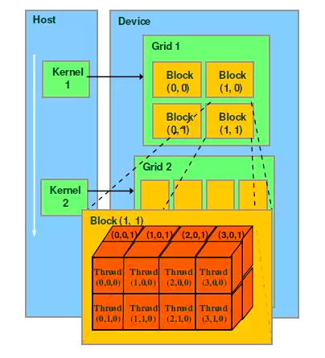
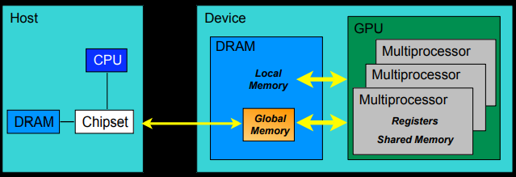

# CUDA
> CUDA（Compute Unified Device Architecture），是显卡厂商NVIDIA推出的运算平台。 CUDA™是一种由NVIDIA推出的通用并行计算架构，该架构使GPU能够解决复杂的计算问题。 它包含了CUDA指令集架构（ISA）以及GPU内部的并行计算引擎。 开发人员现在可以使用C语言来为CUDA™架构编写程序，C语言是应用最广泛的一种高级编程语言。所编写出的程序可以在支持CUDA™的处理器上以超高性能运行。

[toc]

## CUDA执行的典型流程
在讨论之前，我们先对所用术语进行一些定义。在CUDA中，CPU为Host，GPU为Device，一个Kernal函数为一个由CPU调用，在GPU进行执行的函数。如图：


CUDA所做的事情就是CPU将数据交给GPU执行并行计算。不失一般性的，可以将CUDA的流程描述为：
1. 将数据从Host加载到Device，包括：
    ```c
    //在GPU上创建变量的储存空间
    cudaMalloc(); 
    //将数据从CPU加载到GPU的对应地址
    cudaMemcpy(,,,cudaMemcpyDeviceToHost);
    ```
2. 调用Kernal函数，在Device进行计算。
3. 将数据从Device取回Host，包括
    ```c
    //将数据从CPU的对应地址读回
    cudaMemcpy(,,,cudaMemcpyDeviceToHost);
    //释放空间
    cudaFree();
    ```

## CUDA的架构
### 简说GPU并行计算与CPU串行计算
CUDA执行Kernal的最基本单元是Thread，在CPU调用Kernal时，GPU每个thread**同时、并行**执行**同一个**Kernal（exactly same kernal）。因此，在函数内部通常通过线程ID的不同，来实现对不同数据的访问，而不是传入不同数据。在调用时，传入的是数组的指针。

CUDA内部提供的获取线程ID的方法为`threadIdx`，简单起见只考虑一维情况下，对一向量进行翻倍的操作，其Kernal为：

```c
__global__ void double_vector(float *x){
    const int i = threadIdx.x;
    x[i] = 2*x[i];
}
```

执行该函数时，每个thread分别取对应位置的数据进行翻倍，并行执行。假设向量的长度为`MAX_VECTOR_SIZE`，那需要调用`MAX_VECTOR_SIZE`条thread来进行执行。它等价于CPU中的函数：

```c
void double_vector(float *x){
    for(int i = 0; i < MAX_VECTOR_SIZE; i++){
        x[i] = 2*x[i];
    }
}
```
由这个简单例子的例子可以看出CPU串行计算与GPU并行计算（理论上和编程实现上）的不同，对于语句`x[i] = 2*x[i];`，在CPU上使用1条线程，通过循环执行了`MAX_VECTOR_SIZE`次；在GPU上使`MAX_VECTOR_SIZE`条线程，每条线程执行1次实现。

这体现了在面对大批量、无耦合数据的计算时通过CUDA进行并行计算的优越性。但是话虽这么说，在计算量不足够大的情况下往往会发现通过CUDA优化的并行程序计算时间并不比CPU执行的更快，差不多，甚至更慢，这是因为数据在CPU和GPU之间传输需要的时间较长导致的，即`cudaMemcpy()`较慢。因此，在CUDA编程中要尽量减少Host和Device之间的数据交互，以一批上传，一批计算，再一批取回为好。

### CUDA的线程架构

CUDA中，Kernal执行的基本单元（理论）是**thread**。thread的集合为**block**。block可以为一维、二维或者三维（如果不需要多维，令其他维度为1即可），即一个block中有线程ID`(x,y,z)`，获取block中线程ID的方法为：

```c
int x, y, z;
x = threadIdx.x;
y = threadIdx.y;
z = threadIdx.z;
```

易知，一个具有意义的Kernal至少应该分布在**一个**具有**若干**thread的block上进行执行。

需要注意的是，一个block中最多只能包含1024条thread，即有`x*y*z <= 1024`，如果计算要求有更多的thread，那么需要分布在多block上进行执行。

block的集合是grid。grid只可以为一维或者二维，获取grid中block ID的方法为：

```c
int x, y;
x = blockIdx.x;
y = blockIdy.y;
```

在调用Kernal的时候，需要通过`<<<grid, block>>>`声明Kernal分配在多少个grid和block上进行执行。

在同一个block里的thread具有共享的shared memory，其访问速度较快。反过来说，分布在不同block进行执行的thread的问题是不能共用一shared memory，这是由硬件架构限制的。

### CUDA的内存


在选用储存类型上，主要考虑点差异点有：
- 每个grid（若干个block）共用自己的global memory
- 每个block（若干个thread）共用自己的shared memory
  
其中，shared memory的访问速度要快于global memory，但缺点是只能在同一个block里的thread可以访问。在Kernal中声明或者使用shared memory中的变量需要有关键字`__shared__`，如：

```c
__shared__ int result[];
```

在host执行`cudaMalloc()`和`cudaMemcpy()`会将数据加载到global memory。


### CUDA的编程模型

关键字 | 执行在host/device | 只能由host/device调用 | 注
:-: | :-: | :-: | :-:
`__device__ float DeviceFunc()` | device | decice
`__global__ void KernalFunc()` | device | host | 返回值必须为void
`__host__ float HostFunc()` | host | host

## PyCUDA example
