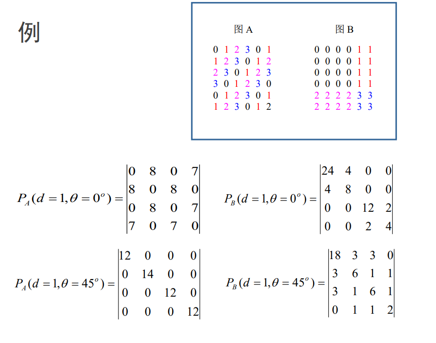

# 数字图像分析复习

[TOC]

## 2 相关图像基础

### 像素间联系
#### 像素间距离度量
对于两个像素点$p(x,y)$，$q(s,t)$，他们之间的距离需要有一定的度量方法描述，一个统一的描述这一性质的方法是p-范数（p-norm）

$$D(p,q)=\left( |x-s|^p + |y-t|^p \right)^{\frac{1}{p}}$$

常用的典型距离度量函数有：
1. **欧氏距离**
   $$D_E(p,q)=\left( |x-s|^2 + |y-t|^2 \right)^{\frac{1}{2}}$$ 
   即2-范数。

2. **城区距离**
    $$D_4(p,q)=|x-s| + |y-t|$$
    即1-范数。

3. **棋盘距离**
    $$\begin{aligned}
        D_8(p,q) &= \max(|x-s|,|y-t|) \\
        &= \left( |x-s|^\infty + |y-t|^\infty \right)^{\frac{1}{\infty}}
    \end{aligned}$$
    即$\infty$-范数。
    
    > 该式的证明可以参考：
    >
    > 设有一实向量$\boldsymbol{x}=(x_1,x_2,\cdots,x_n)$，其中> $x_m$为最大值，即有$x_m=\max_i |x_i|$。要证
    >
    > $$\left\|\boldsymbol{x}\right\|_\infty = \max_i |x_i|$$
    > 有：
    >
    > $$\begin{aligned}
    >     \left\|\boldsymbol{x}\right\|_\infty 
    >     &= \lim_{p\rightarrow\infty} \left( x_1^p + x_2^p + \cdots + x_n^p\right)^{\frac{1}{p}} \\
    >     &= \lim_{p\rightarrow\infty} \left[ x_m^p \left((\frac{x_1}{x_m})^p + (\frac{x_2}{x_m})^p + \cdots  + (\frac{x_n}{x_m})^p\right) \right]^{\frac{1}{p}}\\
    >     &= x_m \lim_{p\rightarrow\infty} \left[ (\frac{x_1}{x_m})^p + (\frac{x_2}{x_m})^p + \cdots + (\frac{x_n}{x_m})^p \right]^{\frac{1}{p}}
    > \end{aligned}$$ 
    >
    > 因为$x_m$为最大值，所以当$x_i \not= x_m$时，$\dfrac{x_i}{x_m} < 1$，有：
    >
    > $$\lim_{p\rightarrow\infty} \left(\frac{x_i}{x_m}\right)^p = 0$$
    >
    > 设有$k$项$x_i = x_m$，$k$为一个有限整数，则有：
    >
    > $$\begin{aligned}
    >      \left\|\boldsymbol{x}\right\|_\infty
    >      &= x_m \lim_{p\rightarrow\infty} \left[0+0+\cdots+k\right]^{\frac{1}{p}} \\
    >      &= x_m
    > \end{aligned}$$

#### 邻接
邻接（adjacency）：
- 主要强调像素间空间关系

1. **4-邻域：**$N_4(p)$
    $$N_4(p)=\{r|D_4(p,r)=1\}$$
2. **8-邻域：**$N_8(p)$
    $$N_8(p)=\{r|D_8(p,r)=1\}$$
3. **对角邻域：**$N_D(p)$

#### 连接
连接（connectivity）：
- 像素间空间关系（邻接）
- 灰度值满足某个特性相似准则（像素$p$和$r$在同一个灰度值集合$V$取值）

1. **4-连接**
2. **8-连接**
3. **m-连接（混合连接）**
    $p$和$r$都在灰度值集合$V$中取值，且满足下列条件之一：
    - $r$在$N_4(p)$中
    - $r$在$N_D(p)$中，且$N_4(p)\cap N_D(p)$中的像素灰度均不在$V$中

m-连接可以消除8-连接产生的歧义性。

#### 连通
从$p(x,y)$到$q(s,t)$有一系列依次连接的像素组成通路，称作连通。连接是连通的一种特例。
#### 连通悖论
问题：

- 对于给定区域$R$，如何定义边界点和内部点？

关于如何定义边界，应该有更进一步的思考：

- 如何合适的定义边界，确保内外不连通？

容易想到采用邻域定义：一个点的邻域内的点一定与其本身邻接（这是邻域和邻接的定义！）。所以要使内外不连通，可以如此定义：

- 一个点的邻域内都是$R$中的点：说明其是内部点
- 反之，一个点的邻域内存在$R$外的点：说明其是边界点

但是，由于对于正方形采样有两种邻域定义，所以边界有两种定义方法：

1. **8-连通边界，4-连通内部**
    边界：

    $$\{p \in R | N_4(p)-N_4(p) \cap R \not= \emptyset\}$$

    内部：

    $$\{p \in R | N_4(p)-N_4(p) \cap R = \emptyset \}$$

    > 条件等价于$N_4(p) \in R$

2. **4-连通边界，8-连通内部**
    边界：

    $$\{p \in R | N_8(p)-N_8(p) \cap R \not= \emptyset\}$$

    内部：

    $$\{p \in R | N_8(p)-N_8(p) \cap R = \emptyset\}$$
    
    > 条件等价于$N_8(p) \in R$

可以看到（直接由定义得出），对于前者来说，一定有内部4-连通；对于后者，一定有内部8-连通。

可以证明，对于前者，一定有边界8-连通；对于后者，一定有边界4-连通。

> 但我并不知道怎么证，大概可以通过枚举正方形网格中边界的形状证明？

> 从直觉上讲，“边界”一定是一个连通集合。一个优雅的定义需要满足这一点。

如果不承认这一点，可以产生以下的矛盾，即连通悖论：

图(a)为区域$R$
图(b)内部8-连通，边界4-连通
图(c)内部4-连通，外部8-连通

1. 从(b)，如果内部也取4-连通：
    则(d)中“？”也应该为内部，产生了矛盾。
2. 从(c)，如果边界也取4-连通：
    则(d)中“？”也应该为边界，产生了矛盾。

> 实质上，连通悖论是对定义的错误解读导致的。

阐述悖论的最简图形：

最简局部分析（个人想法）：

其中实心点属于区域$R$，空心点不属于区域$R$。关键在于：

- 如何选取边界点
- 右下点属于内部？边界？

### 2D-DFT性质
名称    |   空域    |   频域
:-:     |   :-:     |   :-:
线性    |   $$f_1(x,y)+f_2(x,y)$$  |$$F_1(u,v)+F_2(u,v)$$
比例    |   $$f(ax,by)$$   |   $$\frac{1}{ab}F(\frac{u}{a},\frac{v}{b})$$
空域平移    |   $$f(x-a,y-b)$$  |   $$e^{-j2\pi (au+bv)}F(u,v)$$
频域平移    |   $$e^{j2\pi(cx+dy)}f(x,y)$$  |   $$F(u-c,v-d)$$
空域卷积    |   $$f_1(x,y) \ast f_2(x,y)$$   |   $$F_1(u,v)F_2(u,v)$$
频域卷积    |   $$f_1(x,y)f_2(x,y)$$    |   $$F_1(u,v) \ast F_2(u,v)$$ 
旋转    |   $$f(x\cos\theta+y\sin\theta,-x\sin\theta+y\cos\theta)$$ |   $$F(u\cos\theta+v\sin\theta,-u\sin\theta+v\cos\theta)$$

$$
\left[\begin{matrix}
    \cos\theta & \sin\theta \\
    -\sin\theta & \cos\theta
\end{matrix}\right]
\left[\begin{matrix}
    x \\
    y
\end{matrix}\right]
\underleftrightarrow{\mathcal{F}}
\left[\begin{matrix}
    \cos\theta & \sin\theta \\
    -\sin\theta & \cos\theta
\end{matrix}\right]
\left[\begin{matrix}
    u \\
    v
\end{matrix}\right]
$$

### 图像增强
#### 灰度映射
原图$s$，目标图像$t$

$$t = E_H(s)$$

#### 直方图修正
有$L$个灰度级$\{0,1,\cdots,L-1\}$
灰度统计直方图：
$$h(k) = n_k, k=0,1,\cdots,L-1$$

灰度统计累计直方图：
$$H(k) = \sum_{i=0}^{k} n_i, k=0,1,\cdots,L-1$$

##### 直方图均衡
把直方图变为均匀分布，用于增强对比度。
$s_k$为第$k$级灰度值。

$$p_s(s_k) = \frac{n_k}{N}$$

$$t_k = E_H(s_k) = \sum_{i=0}^{k}\frac{n_i}{N} = \sum_{i=0}^{k}p_s(s_i)$$

> 实际上，就是灰度统计累计直方图。

##### 直方图匹配（规定化）
1. 均衡化
2. 规定需要的直方图，计算能使规定直方图均衡化的变换
3. 使用2的反变换处理1的均衡化直方图

#### 锐化
- 频域高通滤波
- 空域梯度算子卷积

#### 平滑
- 频域低通滤波
- 空域
  - 均值滤波
  - 中值滤波
- 多帧平均

#### 伪彩色
##### 色彩空间
- RGB
- HSI
  - Intensity 亮度
  - Hue 色度
  - Saturation 饱和度
##### 方法
- 灰度分层法
- 变换法

#### 同态滤波
图像包括照射分量和反射分量：
$$f(x,y) = i(x,y)\cdot r(x,y)$$

1. 取对数
2. 傅里叶变换
3. 滤波
4. 傅里叶反变换
5. 取指数

能消除乘性噪声，压缩动态范围，增强相邻区域对比度。

### 图像恢复
#### 空域滤波
> 处理加性噪声

- 均值滤波器
    - 算术平均滤波器(Arithmetic mean filters)
        $$\hat{f}(x,y)=\frac{1}{mn}\sum_{(s,t \in S)}g(s,t)$$

    - 几何平均滤波器(Geometric mean filter)
        $$\hat{f}(x,y)=\left[\prod_{(s,t \in S)}g(s,t)\right]^{\frac{1}{mn}}$$

    - 调和平均滤波器(Harmonic mean filter)
        $$\hat{f}(x,y)=\frac{mn}{\sum_{(s,t \in S)}\frac{1}{g(s,t)}}$$

    - 反调和平均滤波器(Contraharmonic filter)

- 次序统计滤波器
    - 中值滤波器(Median filter)
        $$\hat{f}(x,y) = median\{g(s,t)\}$$

    - 最大最小滤波器(Max and min filters)
        $$\left\{\begin{aligned}
            \hat{f}(x,y) = \max \{g(s,t)\} \\
            \hat{f}(x,y) = \min \{g(s,t)\} \\
        \end{aligned}\right.$$

    - 中点滤波器(Midpoint filter)
        $$\hat{f}(x,y) = \frac{1}{2}\left[\max \{g(s,t)\} + \min \{g(s,t)\}\right]$$

    - Alpha截取均值滤波器(Alpha-trimmed mean filter)
        $$\hat{f}(x,y) = \frac{1}{mn-d}\sum g_r(s,t)$$
        
        > 去掉最大最小的若干个

#### 频域滤波
- 带通
- 带组
- 槽口

#### 运动恢复建模估计 √
均匀线性运动：

$$g(x,y) = \int_0^T f\left( x-x_0(t), y-y_0(t) \right) dt$$

两边取傅里叶变换可以得到形式：

$$G(u,v) = F(u,v) \cdot H(u,v)$$

#### 几何矫正
1. 坐标几何矫正（空间变换）
    $$g(x,y) = f(x',y') = f(a(x,y),b(b,y))$$

2. 象素灰度值的估计(灰度插值)
    - 实现
      1. 前向映射
      2. 后向映射（常用）

    - 方法
      1. 最近邻赋值
      2. 双向线性差值
      3. 高阶插值

### 图像增强和图像恢复的区别
图像在形成、传输和记录中，由于成像系统、传输介质和设备的不完善，导致图像质量下降，这一现象称为图像退化。

图像复原和图像增强是有区别的，虽然二者的目的都是为了改善图像的质量，但图像增强不考虑图像是如何退化的，只通过试探各种技术来来增强图像的视觉效果。因此，图像增强可以不顾增强后的图像是否失真，只要看着舒服就行。而图像复原则完全不同，需知道图像退化的机制和过程等先验知识，据此找出一种相应的逆过程解算方法，从而得到复原的图像。如果图像已退化，应先做复原处理，再做增强处理。

数字图象恢复与增强的目的类似，也是旨在改善图象的质量

但恢复是力求保持图象的本来面目，即以保真原则为其前提，这是区别于增强的基本不同点。因而恢复时要了解图象质量下降的物理过程，找出或估计其物理模型。恢复的过程就是沿着质量下降的逆过程来重现原始图象

## 3 数字化图像
### 图像采集网格

- 图像网格：
    像素之间的拓扑关系。
- 采样模式：
    每个像素的形状。
- 采样效率：
    单位圆面积与覆盖该单位圆的网格面积之比。

图像网格 | 采样模式 | 采样效率 | 备注
:-: | :-: | :-: | :-:
三角形 | 六边形 | $\pi / 2\sqrt{3} = 0.91$
正方形 | 正方形 | $\pi / 4 = 0.79$ | 直观，无边界问题；存在“连通悖论”
六边形 | 三角形 | $\pi / 3\sqrt{3} = 0.60$ | 

### 方盒量化、网格量化
#### 方盒量化（SBQ）
对于像素$p_i(x_i,y_i)$有其对应数字化盒：

$$B_i=[x_i-1/2,x_i+1/2)\times[y_i-1/2,y_i+1/2)$$

记原图像为$S$（连续），数字化得到点集$P$

当且仅当

$$B_i \cap S \not= \emptyset$$

$p_i$在$P$中。

上述过程可以简记为：

$$P = \{p_i|B \cap S \not= \emptyset\}$$

> - 对一个连续直线段的方盒量化（SBQ）的结果是一个4-数字弧
> - 方盒量化的定义保证了非空集合$S$会被映射到非空离散集合$P$
> - 不能保证平移不变性

#### 网格相交量化（GIQ）
对于（连续）细目标$C$与网格线相交的实数点$t(x_t,y_t)$，当：

$$t \in (x_i-1/2,x_i+1/2)\times(y_i-1/2,y_i+1/2)$$

$p_i(x_i,y_i)$在$P$中。

当$x_t = x_i+1/2$或$y_t = y_i+1/2$时取左边/上边的$p_i$

> 这不就是$t \in (x_i-1/2,x_i+1/2]\times(y_i-1/2,y_i+1/2]$？

> - 对一个连续直线段的方盒量化（SBQ）的结果是一个8-数字弧

### 数字弦、紧致弦
#### 数字弧
对于任意一点，相邻两点在邻域内。

#### 数字弦
对于8-数字弧，弦：

任意数字弧中两点连线上任意一（连续）点，与弧（存在一点）距离$D_8<1$。

> - 在8数字空间中，任一直线段的数字化结果，必是一条数字弦；
> - 任一条数字弦，也必存在一条直线段,其数字化结果与该弦同。

##### 紧致弦
对于8-数字弧，紧致：

满足$D_4 < 1$

### 2D距离变换
**Motivation**：
对于离散集合$P$（一张图像）中的一个子集$B$（一个区域），想要知道图中其它像素点与其距离。

- 对于每个点单独计算：繁琐，计算量大。
- 直接生成全局距离图

**定义**：
对于局部距离模板$M(k,l)$，求取（全局）距离图$DT(p)$。

**更新方程**：

对于任意$p \not\in B$（区域外的点），有$q \in N(p)$。第$t$步距离图为$DT^{(t)}$。

$$DT^{(t)}(p) = \min_{k,j}\{DT^{(t-1)}(q) + M(q-p)\}$$

> $q-p$指相对于模板中心的偏移量，p为模板$M$中心，$M(q-p)$即为$p$、$q$之间距离$d(p,q)$

#### 局部距离模板形式
- 4-邻域模板，扩展$d_4$距离

    $$\left[\begin{matrix}
        \infty & a & \infty \\
        a & 0 & a \\
        \infty & a & \infty
    \end{matrix}\right]$$

- 8-邻域模板，扩展$d_8$/$d_{a,b}$距离

    > 实际上对于$d_8$来说等价于$d_{a,b}$且$a=1$，$b=1$

    $$\left[\begin{matrix}
        b & a & b \\
        a & 0 & a \\
        b & a & b
    \end{matrix}\right]$$

- 16-邻域模板，扩展$d_{a,b,c}$距离

    $$\left[\begin{matrix}
        \infty & c & \infty & c & \infty \\
        c & b & a & b & c \\
        \infty & a & 0 & a & \infty\\
        c & b & a & b & c \\
        \infty & c & \infty & c & \infty 
    \end{matrix}\right]$$

#### 串行实现
#### 并行实现

## 4 边缘检测

### 正交梯度算子

### 方向微分算子

### 二阶导数算子
#### Laplace算子
#### Marr算子
1. 高斯
2. 拉普拉斯
3. 取过零点为边缘

### Canny算子
Canny算子是用于边缘检测（Edge Detection）的算子，与简单的一阶差分算子（Roberts算子、Sobel算子等）、二阶差分算子（Laplace算子）等相比具有较好的性能，是被广泛应用的边缘检测方法。J. Canny于1986年在*A Computational Approach to Edge Detection*[^canny_paper]中提出Canny算子，并且指出一个好的边缘检测算子应有的三个指标：

[^canny_paper]:J. Canny A Computational Approach to Edge Detection, IEEE Transactions on Pattern Analysis and Machine Intelligence, Vol. 8, No. 6, Nov. 1986. 

> - **低失误概率**
> 既要少将真正的边缘丢失也要少将非边缘判为边缘
> - **高位置精度**
> 检测出的边缘应在真正的边界上
> - **对每个边缘有唯一的响应**
> 得到的边界为单象素宽

Canny算子的实现主要步骤可以分为：

1. 灰度化
2. 高斯平滑滤波
3. 计算梯度大小与方向
4. 非极大值抑制
5. 双阈值检测和连接

#### 高斯滤波器和高斯差分滤波器
高斯滤波器是对图像进行平滑的滤波器。记$r$为平滑半径，$r\in N^+$，则高斯核为一个$(2r+1)\times (2r+1)$的矩阵。高斯核的生成公式为：
$$\displaystyle{
    h=\frac{1}{\sqrt{2\pi \sigma}} e^{-\frac{x^2+y^2}{2\sigma^2}
}}$$

记图像为$f$，对图像先进行高斯卷积滤波，再求梯度。由于卷积算子和差分算子均为**线性算子**，因此可以交换计算顺序，有：
$$\nabla(f \ast h)=(\nabla h)\ast f $$

因此可以得到：
$$\nabla h = (h_x,h_y)=(\frac{\partial h}{\partial x},\frac{\partial h}{\partial y})$$

即意味着高斯滤波器和差分算子可以合成一个算子，称作高斯差分算子（Differiential of Gaussian, DoG）。使用该算子对图像进行处理可以直接得到等效为高级平滑滤波和求差分两步的结果。

对于差分算子在数字图像分析中也有不同的实现形式，如可以使用Sobel算子，则有

$$\displaystyle{
    \frac{\partial}{\partial x} =
    \left[\begin{matrix}
        -1 & 0 & 1 \\
        -2 & 0 & 2 \\
        -1 & 0 & 1
    \end{matrix}\right]
    ,
    \frac{\partial}{\partial y} =
    \left[\begin{matrix}
        1 & 2 & 1 \\
        0 & 0 & 0 \\
        -1 & -2 & -1
    \end{matrix}\right]
}$$

将Sobel算子与高斯核求相关，即可得到高斯差分核。

或者也可以直接对高斯核生成公式求偏微分，可以直接得到高斯差分核的生成公式，有：

$$\displaystyle{\begin{aligned}
    h_x = \frac{\partial h}{\partial x} = \frac{-x}{\sigma^2 \sqrt{2 \pi \sigma}} e^{-\frac{x^2+y^2}{2\sigma^2}} \\
    h_y = \frac{\partial h}{\partial y} = \frac{-y}{\sigma^2 \sqrt{2 \pi \sigma}} e^{-\frac{x^2+y^2}{2\sigma^2}}
\end{aligned}}$$

#### 非极大值抑制
基于最近邻的非极大值抑制方法主要可以分为三步：

1. 将梯度角$\theta[i, j]$的变化范围分为四个扇区
2. 用$3\times 3$邻域作用于幅值图像$M[i, j]$，邻域中心像素$M[i, j]$与沿着梯度线方向的两个像素进行比较
3. 若$M[i, j]$不比沿梯度线方向的两个相邻点幅值大，则像素的(i, j)被抑制, $M[i, j]$被置为$0$。

#### 双阈值检测和连接
双阈值算法采用两个阈值$\tau_1$和$\tau_2$，$\tau_1$为低阈值，$\tau_2$为高阈值。主要步骤为：

1. 对于图像中的像素点，其灰度值低于$\tau_1$的可以判定为一定是边缘，高于$\tau_2$的一定不是边缘。
2. $\tau_2$生成的图像含有假边缘少但有间断点，以$\tau_2$生成的图像为指导，在$\tau_1$的8-邻域内寻找可以连接的点。
3. 重复第二步，直到所有边缘都连接。

### SUSAN算子
USAN: Univalue Segment Assimilating Nucleus
SUSAN：最小（Smallest） 核同值区(USAN)

核中心$(x_0,y_0)$，模板中的点$(x,y)$

$$C(x,y;x_0,y_0)=\left\{\begin{aligned}
    1&,|f(x_0,y_0)-f(x,y)| \leq T \\
    0&,|f(x_0,y_0)-f(x,y)| > T
\end{aligned}\right.$$

游程和：

$$S(x_0,y_0) = \sum_{(x,y)\in Nucleus(x_0,y_0)} C(x_0,y_0;x,y)$$

边缘响应：

$$R(x_0,y_0)\left\{\begin{aligned}
    &G-S(x_0,y_0) ,& S(x_0,y_0)<G \\
    &0 ,& \text{otherwise}
\end{aligned}\right.$$

几何阈值$G = 3S_{max}/4$。$S_{max}$是模板面积
## 5 图像分割
### 阈值分割
### 区域生长法
### 分裂合并法
### 聚类分割
#### K-means
1. 初始化K个聚类中心$\{\mathcal{\mu}_1,\cdots,\mathcal{\mu}_k\}$
2. 最小距离法分类所有样本
3. 重新计算各类中心
4. 重复执行2、3，直至收敛。

### 主动轮廓
#### 从曲线演化到水平集？

#### 水平集方法
水平集方法（Level Set）是基于主动轮廓模型的图像分割方法，相比于Snake方法他可以更好的解决重新参数化困难的问题，也能够处理拓扑变化。

##### 变分法推导演化方程 √
在水平集方法的应用中，往往多步迭代会使得水平集函数降质（Degraded），对于这种问题常常采用重新初始化的方法。在2005年，不需重新初始化的水平集方法[^1]被提出，这部分将对其演化方程做出推导。

[^1]:Li C, Xu C, Gui C, et al. Level set evolution without reinitialization: a new variational formulation[C]//Computer
Vision and Pattern Recognition, CVPR 2005.
Level Set without Re-initialization

定义变分能量函数：
$$\epsilon (\phi) = \mu \mathcal{P}(\phi) + \lambda \mathcal{L}_g(\phi) + \nu \mathcal{A}_g(\phi)$$

其中有：
$$\left\{\begin{aligned}
    \mathcal{P}(\phi) &= \int_\Omega \frac{1}{2}(\left|\nabla \phi \right| - 1)^2 dxdy \\
    \mathcal{L}_g(\phi) &= \int_\Omega g \delta(\phi) \left|\nabla\phi\right| dxdy \\
    \mathcal{A}_g(\phi) &= \int_\Omega gH(-\phi) dxdy
\end{aligned}\right.$$

本次文主要分析对$\mathcal{L}_g(\phi)$和$\mathcal{A}_g(\phi)$的推导。

步骤为
1. 令$\phi = \phi + \alpha h$
2. 对$\alpha$求导
3. 取$\alpha \rightarrow 0$
   
###### $\mathcal{L}_g(\phi)$项的推导
对于$\displaystyle{\mathcal{L}_g(\phi) = \int_\Omega g \delta(\phi) \left|\nabla\phi\right| dxdy}$，令：

$$F(\phi) = g \delta(\phi) \left|\nabla\phi\right|$$

令$h$为一个满足$h \Big|_{\partial\Omega}=0$的任意函数，令$\alpha$为一个小常数，有：

$$\begin{aligned}
    F(\phi + \alpha h) &= g \delta(\phi + \alpha h) \left|\nabla(\phi + \alpha h)\right| \\
    &= g \delta(\phi + \alpha h) \sqrt{ {(\phi+\alpha h)_x}^2 + {(\phi+\alpha h)_y}^2}
\end{aligned}$$

对其求偏导，有：

$$\begin{aligned}
    \frac{\partial F(\phi+\alpha h)}{\partial\alpha} &= g\left( h\delta^{'}(\phi+\alpha h)\sqrt{ {(\phi+\alpha h)_x}^2 + {(\phi+\alpha h)_y}^2} + \delta(\phi + \alpha h)\frac{\nabla h \cdot \nabla(\phi+\alpha h)}{ \sqrt{ {(\phi+\alpha h)_x}^2 + {(\phi+\alpha h)_y}^2}} \right)
\end{aligned}$$

> $$\frac{\partial}{\partial\alpha}\left(\frac{\partial(\phi+\alpha h)}{\partial x}\right) = \frac{\partial}{\partial\alpha}\left(\frac{\partial\phi}{\partial x} + \alpha \frac{\partial h}{\partial x}\right) = \frac{\partial}{\partial\alpha}(\phi_x + \alpha h_x)$$

> $$\phi_xh_x+\phi_yh_y = (\phi_x,\phi_y)\cdot(h_x,h_y)$$

当$\alpha$足够小时，

$$\begin{aligned}
    \frac{\partial F(\phi+\alpha h)}{\partial\alpha} \bigg|_{\alpha \rightarrow 0} = g\left( h\delta^{'}(\phi)\left| \nabla \phi \right| + \delta(\phi)\frac{h_x\phi_x + h_y\phi_y}{\left| \nabla \phi \right|} \right)
\end{aligned}$$

则有：

$$
    \frac{\partial \mathcal{L}_g(\phi+\alpha h)}{\partial\alpha} \bigg|_{\alpha \rightarrow 0} 
    = \int_\Omega gh\delta^{'}(\phi)\left| \nabla \phi \right| dxdy
    + \int_\Omega g \delta(\phi)\frac{h_x\phi_x + h_y\phi_y}{\left| \nabla \phi \right|} dxdy 
$$

对于第二个积分：
$$\begin{aligned}
    & \quad \int_\Omega g \delta(\phi)\frac{h_x\phi_x + h_y\phi_y}{\left| \nabla \phi \right|} dxdy \\
    &= \int_\Omega \left( \frac{g\delta(\phi)\phi_x}{\left| \nabla \phi \right|} h_x \right) dxdy + \int_\Omega\left( \frac{g\delta(\phi)\phi_y}{\left| \nabla \phi \right|} h_y \right) dxdy \\
    &= \int_\Omega \left( 
        \frac{\partial}{\partial{x}}\left[ \frac{g\delta(\phi)\phi_x}{\left| \nabla \phi \right|} h\right]
        - \frac{\partial}{\partial{x}}\left[ \frac{g\delta(\phi)\phi_x}{\left| \nabla \phi \right|}\right]h 
        \right) dxdy 
    + \int_\Omega \left( 
        \frac{\partial}{\partial{y}}\left[ \frac{g\delta(\phi)\phi_y}{\left| \nabla \phi \right|} h\right] - \frac{\partial}{\partial{y}}\left[ \frac{g\delta(\phi)\phi_y}{\left| \nabla \phi \right|}\right]h 
    \right) dxdy \\
    &= \int_\Omega \left( 
        \frac{\partial}{\partial{x}}\left[ \frac{g\delta(\phi)\phi_x}{\left| \nabla \phi \right|} h\right] 
        +\frac{\partial}{\partial{y}}\left[ \frac{g\delta(\phi)\phi_y}{\left| \nabla \phi \right|} h\right]  \right) dxdy 
    -\int_\Omega \left( 
        \frac{\partial}{\partial{x}}\left[ \frac{g\delta(\phi)\phi_x}{\left| \nabla \phi \right|}\right]h 
        +\frac{\partial}{\partial{y}}\left[ \frac{g\delta(\phi)\phi_y}{\left| \nabla \phi \right|}\right]h 
    \right) dxdy 
\end{aligned}$$

> $$(fh)_x - f_xh = fh_x$$

对于左边项，由格林公式$\displaystyle{\oint_{\partial{\Omega}}Rdx+Sdy=\iint_{\Omega}\left( \frac{dS}{dx} - \frac{dR}{dy} \right)dxdy}$，且$h$满足$h \Big|_{\partial\Omega}=0$，有：

$$\begin{aligned}
    &\int_\Omega \left( 
        \frac{\partial}{\partial{x}}\left[ \frac{g\delta(\phi)\phi_x}{\left| \nabla \phi \right|} h\right] 
        +\frac{\partial}{\partial{y}}\left[ \frac{g\delta(\phi)\phi_y}{\left| \nabla \phi \right|} h\right]  \right) dxdy 
        = \oint_{\partial{\Omega}} h\left( \frac{g\delta(\phi)\phi_x}{\left| \nabla \phi \right|}dx - \frac{g\delta(\phi)\phi_y}{\left| \nabla \phi \right|}dy \right) = 0
\end{aligned}$$

因此
$$\begin{aligned}
    \int_\Omega g \delta(\phi)\frac{h_x\phi_x + h_y\phi_y}{\left| \nabla \phi \right|} dxdy 
    &= -\int_\Omega h \left( 
        \frac{\partial}{\partial{x}}\left[ \frac{g\delta(\phi)\phi_x}{\left| \nabla \phi \right|}\right]
        + \frac{\partial}{\partial{y}} \left[\frac{g\delta(\phi)\phi_y}{\left| \nabla \phi \right|}\right]
    \right) dxdy \\
    &= -\int_\Omega h \left( 
        \nabla \cdot (g\delta(\phi) \frac{\nabla\phi}{\left| \nabla \phi \right|})
    \right) dxdy \\
\end{aligned}$$

其中

$$\begin{aligned}
    \nabla \cdot (g\delta(\phi) \frac{\nabla\phi}{\left|\nabla\phi\right|})
    &= \frac{\partial}{\partial x} \left( \frac{g\delta(\phi)}{\left|\nabla\phi\right|} \frac{\partial\phi}{\partial x} \right) + \frac{\partial}{\partial y} \left( \frac{g\delta(\phi)}{\left|\nabla\phi\right|} \frac{\partial\phi}{\partial y} \right) \\
    &= \frac{\partial\delta}{\partial x} \left( \frac{g}{\left|\nabla\phi\right|} \frac{\partial\phi}{\partial x} \right) 
    + \delta \frac{\partial}{\partial x} \left( \frac{g}{\left|\nabla\phi\right|} \frac{\partial\phi}{\partial x} \right)
    + \frac{\partial\delta}{\partial y} \left( \frac{g}{\left|\nabla\phi\right|} \frac{\partial\phi}{\partial y} \right) 
    + \delta \frac{\partial}{\partial y} \left( \frac{g}{\left|\nabla\phi\right|} \frac{\partial\phi}{\partial y} \right) \\
    &= \frac{\partial\delta}{\partial\phi} \left( \frac{\partial\phi}{\partial x} \frac{g}{\left|\nabla\phi\right|} \frac{\partial\phi}{\partial x} + \frac{\partial\phi}{\partial y} \frac{g}{\left|\nabla\phi\right|} \frac{\partial\phi}{\partial y} \right) 
    + \delta \left( \frac{\partial}{\partial x} , \frac{\partial}{\partial x}\right) \cdot \left( \frac{g}{\left|\nabla\phi\right|} \frac{\partial\phi}{\partial x}, \frac{g}{\left|\nabla\phi\right|} \frac{\partial\phi}{\partial y} \right) \\
    &= \delta^{'}(\phi)\frac{g(\phi_x^2 + \phi_y^2)}{\left|\nabla\phi\right|} + \delta(\phi) \nabla\cdot\left( \frac{g}{\left|\nabla\phi\right|} \left( \frac{\partial}{\partial x} , \frac{\partial}{\partial x}\right) \cdot \phi \right) \\
    &= g\delta^{'}(\phi)\left|\nabla\phi\right| + \delta(\phi)\nabla\cdot(\frac{g\nabla \phi}{\left| \nabla \phi \right|})
\end{aligned}$$

因此当$\mathcal{L}_g(\phi)$取到最小时，有：

$$\begin{aligned}
    \frac{\partial \mathcal{L}_g(\phi+\alpha h)}{\partial\alpha} \bigg|_{\alpha \rightarrow 0} 
    &= \int_\Omega gh \delta^{'}(\phi)\left| \nabla \phi \right| dxdy - \int_\Omega gh\delta^{'}(\phi)\left|\nabla\phi\right| dxdy - \int_\Omega h \left(\delta(\phi)\nabla \cdot (g \frac{\nabla\phi}{\left| \nabla \phi \right|})\right) dxdy \\
    &= - \int_\Omega h \left(\delta(\phi)\nabla \cdot (g \frac{\nabla\phi}{\left| \nabla \phi \right|})\right) dxdy \\
    &= 0
\end{aligned}$$

由于函数$h$是任意的，必须有：

$$\delta(\phi)\nabla \cdot (g \frac{\nabla\phi}{\left| \nabla \phi \right|}) = 0$$

###### $\mathcal{A}_g(\phi)$项的推导

对于$\displaystyle{\mathcal{A}_g(\phi) = \int_\Omega gH(-\phi) dxdy}$，同理令：

$$F(\phi) = gH(-\phi)$$

> $H(x)$是单位阶跃函数。其导数是$\delta(x)$ 

有：

$$F(\phi+\alpha h) = gH[-(\phi+\alpha h)]$$

$$\begin{aligned}
    \frac{\partial F(\phi+\alpha h)}{\partial\alpha} \bigg|_{\alpha \rightarrow 0} 
    &= -gh \delta[-(\phi+\alpha h)] \bigg|_{\alpha \rightarrow 0} \\
    &= -gh \delta(-\phi)
\end{aligned}$$

有：

$$\begin{aligned}
    \frac{\partial \mathcal{A}_g(\phi+\alpha h)}{\partial\alpha} \bigg|_{\alpha \rightarrow 0} 
    &= - \int_\Omega h \Big( g \delta(\phi) \Big) dxdy
\end{aligned}$$

当$\mathcal{A}_g(\phi)$最小，同理有：

$$g \delta(\phi) = 0$$

###### 演化方程
要使变分能量函数
$$\epsilon (\phi) = \mu \mathcal{P}(\phi) + \lambda \mathcal{L}_g(\phi) + \nu \mathcal{A}_g(\phi)$$

最小化，即求
$$\phi^* = \argmin_\phi \epsilon (\phi)$$

通过上述的推导，有：

$$\begin{aligned}
    \frac{\partial \epsilon(\phi+\alpha h)}{\partial\alpha} \bigg|_{\alpha \rightarrow 0}
    &= \mu \frac{\partial \mathcal{P}_g(\phi+\alpha h)}{\partial\alpha} \bigg|_{\alpha \rightarrow 0} + \lambda\frac{\partial \mathcal{L}_g(\phi+\alpha h)}{\partial\alpha} \bigg|_{\alpha \rightarrow 0} + \nu\frac{\partial \mathcal{A}_g(\phi+\alpha h)}{\partial\alpha} \bigg|_{\alpha \rightarrow 0} \\
    &= \mu \left[ - \int_\Omega h \left(\Delta\phi - \nabla\cdot(\frac{\nabla\phi}{\left|\nabla\phi\right|})\right) dxdy  \right] \\
    &\quad + \lambda \left[  - \int_\Omega h \left(\delta(\phi) \nabla \cdot (g \frac{\nabla\phi}{\left| \nabla \phi \right|})\right) dxdy \right]\\
    &\quad  + \nu \left[ - \int_\Omega h \Big( g \delta(\phi) \Big) dxdy \right] \\
    &= - \int_\Omega h \left[ \mu\left[\Delta\phi - \nabla\cdot(\frac{\nabla\phi}{\left|\nabla\phi\right|}) \right] + \lambda\delta(\phi)\nabla \cdot (g \frac{\nabla\phi}{\left| \nabla \phi \right|}) + \nu g \delta(\phi) \right]dxdy
\end{aligned}$$

当$\epsilon (\phi)$最小，有上式等于$0$。又因为函数$h$是任意的，则有：

$$\mu\left[\Delta\phi - \nabla\cdot(\frac{\nabla\phi}{\left|\nabla\phi\right|}) \right]
    + \lambda \delta(\phi) \nabla\cdot (g \frac{\nabla\phi}{\left| \nabla \phi \right|})
    + \nu g \delta(\phi) = 0$$

可以得到梯度下降法的更新公式：

$$\begin{aligned}
    \frac{\partial\phi}{\partial t}
    = \mu\left[\Delta\phi - \nabla\cdot(\frac{\nabla\phi}{\left|\nabla\phi\right|}) \right]
    + \lambda\delta(\phi) \nabla\cdot (g \frac{\nabla\phi}{\left| \nabla \phi \right|})
    + \nu g \delta(\phi)
\end{aligned}$$

### Graph Cut
最小化能量函数

$$E_x = E_{smooth}(x) + E_{data}(x)$$

$x$是一个分割结果。

？？？

## 6 模板匹配
### 相似性度量
#### （归一化）相关系数

> - 相关函数曲线的峰值不尖锐，或被噪声掩盖
> - 运算量比较大
> - 不具有尺度和旋转不变性

#### 平均交互信息量
#### 不变矩
> - 具有位移、旋转、尺度不变性

### 分层搜索策略
分层粗搜-细搜

### 基本Hough变换
1. 初始化累加数组$A(\mathcal{c})$

2. 在参数空间中，遍历$\mathcal{c}$，求解是否满足$f(\mathcal{x},\mathcal{c})=0$。

3. 如果满足，累加数组$A(\mathcal{c})\rightarrow A(\mathcal{c}) + 1$

对偶性

- 直线

    图像空间$(x,y)$ | 参数空间$(p,q)$
    :-: | :-:
    $$y=px+q$$ | $$q=-px+y$$

- 圆

    图像空间$(x,y)$ | 参数空间$(a,b,r)$
    :-: | :-:
    $$(x-a)^2+(y-b)^2=r^2$$ | $$(a-x)^2+(b-y)^2=r^2$$

- 椭圆

    图像空间$(x,y)$ | 参数空间$(a,b,p,q)$
    :-: | :-:
    $$(\frac{x-p}{a})^2+(\frac{y-q}{b})^2=1$$ | $$(\frac{a-x}{m})^2+(\frac{b-y}{n})^2=1$$

### Hough变换的改进
#### 极坐标（线）
是**单纯**参数空间的转换。极坐标参数空间$(\theta,\lambda)$

$$\lambda = x\cos\theta + y\sin\theta$$

#### 梯度降维（圆、椭圆）
过边缘检测可以求得图像各点$(x,y)$的梯度信息，进而有梯度方向信息$\theta(x,y)$

> $\theta$含义与上节不同，需注意。

- 圆

$$\left\{\begin{aligned}
    a &= x - r\sin\theta \\
    b &= y + r\cos\theta
\end{aligned}\right.$$

分别处理

- 椭圆

## 7 目标表达
### 基于边界的表达
#### 链码
链码（Chain Code）

标识码：
- 起始符：0405X
- 结束符：0400

> e.g. 起始点(1,4)，链码**0405**001**0405**00477002200033355**0400**

##### 链码归一化
- 起点归一化
    选取值最小的自然数顺序

- 旋转归一化
    一阶差分（逆时针方向变化的次数，用最后一位补第一位生成）
    e.g.
    
    名称 | 值 | 值 | 值 | 值 | 值 | 值 | 值 | 值 | 值
    :-: | :-: | :-: | :-: | :-: | :-: | :-: | :-: | :-: | :-: | :-:
    四方向链码 | (2) | 1 | 0 | 1 | 0 | 3 | 3 | 2 | 2 
    差分码 |  | 3 | 3 | 1 | 3 | 3 | 0 | 3 | 0

#### 多边形近似
##### 分裂算法
先连接边界上相距最远的两个点（即把边界分成两部分），然后根据一定的准则进一步分解边界，构成多边形逼近边界，直到拟合误差满足一定的条件。

##### 贪婪算法
先选一个边界点为起点，用直线依次连接该点与相邻的边界点，直至拟合误差超过某个限度。以线段的另一段为起点继续连接边界点，直至绕边界一周。

> 与起点有关，**贪婪**

### 基于区域的表达
#### 四叉树
一分四，与金字塔相同

#### 骨架
定义：
骨架点：与（两个）轮廓点距离最小的点。

对于区域$R$，轮廓$B$，有骨架点$p$：

$$d_s(p,B) = \inf \{d(p,z) | z \in B\}$$

### 基于变换的表达：傅里叶描述子
将点$(x,y)$视作复数$u+jv$

#### 如何预处理消除平移、旋转、尺度变换以及计算起点影响？

- 平移
    零均值化，以中心作为起点。
    令：
    $$\left\{\begin{aligned}
        u_k = x_k - \bar{x} \\
        v_k = y_k - \bar{y}
    \end{aligned}\right.$$

- 缩放
    将每一个点到中心的距离归一化
    $$\alpha_k = [(u_k-\bar{x})^2 + (v_k-\bar{y})^2]^{1\over 2}$$

    $$\left\{\begin{aligned}
        u_k^{'} = \frac{u_k}{\bar{\alpha}} \\
        v_k^{'} = \frac{v_k}{\bar{\alpha}}
    \end{aligned}\right.$$

- 旋转
    取最远的两个点，取其中一点，逆时针旋转到0度

## 8 简单目标描述
### 基于边界的描述
#### 形状数
4-方向（？）差分码中值最小的1个序列

- 阶
    序列的长度
    闭合曲线阶是偶数
    凸形区域形状数的阶$N$对应区域外包矩形的周长$(m+n)\times 2$

##### 获取指定阶数的形状数
从满足$2(m+n)=N$的矩形中选取长短轴比例与区域最接近的。

### 基于区域的描述
#### 拓扑描述符
> 不受畸变变形

##### 欧拉数
$H$：区域内的孔数
$C$：区域内的连通组元个数

$$E=C-H$$

- 4-连通欧拉数
    $$E_4=C_4-H_8$$

- 8-连通欧拉数
    $$E_8=C_8-H_4$$

##### 不变矩
区域矩：
- $p+q$阶矩
    $$m_{pq} = \sum_{x}\sum_{y}x_py_qf(x,y)$$

- $p+q$阶中心矩
    $$\mu_{pq} = \sum_{x}\sum_{y}(x-\bar{x})^p(y-\bar{y})^qf(x,y)$$

- 归一化中心矩
    $$\mathcal{y}_{pq} = \frac{\mu_{pq}}{\mu_{00}^{\gamma}}$$

    $$\gamma = \frac{p+q}{2} + 1$$

平移、旋转、尺度不变矩？（Hu矩？）
共有7个

### 区域标记和计数
#### 像素标记
从左到右、从上到下扫描，检测连通性，连通认为是同一个，反之则设为新目标。

#### 收缩连通元法
- parallel shrinking：并行的逐步收缩连通元。
- label propagation：沿逐次收缩的结果，反向标记连通区域。

## 9 局部视觉特征
### 局部特征点
#### 角点（Corner）检测
##### Harris角点检测子 √
> 满足旋转不变，不满足尺度不变。

在图像$I$上，将窗口$W$移动$(u,v)$后：

$$E(u,v) = \sum_{(x,y)\in W} [I(x+u,y+v)-I(x,y)]^2$$

泰勒展开：

$$\begin{aligned}
    I(x+u,y+v) &= I(x,y) + \frac{\partial I}{\partial x}u + \frac{\partial I}{\partial y}v + o(I) \\
    &\simeq I(x,y) + [I_x \, I_y]\left[\begin{matrix}u \\ v\end{matrix}\right]
\end{aligned}$$

可以推得：

$$\begin{aligned}
    E(u,v) &= \sum_{(x,y)\in W}\left[[I_x \, I_y]\left[\begin{matrix}u \\ v\end{matrix}\right]\right]^2 \\
    &= [u \, v] \sum_{(x,y)\in W} \left[\begin{matrix} I_x^2 & I_xI_y \\ I_yI_x & I_y^2 \end{matrix}\right] \left[\begin{matrix}u \\ v\end{matrix}\right] \\
    &= [u \, v] M \left[\begin{matrix}u \\ v\end{matrix}\right]
\end{aligned}$$

求解$M$的特征值、特征向量

令

$$[u,v]^T = a\boldsymbol{x}_{max} + b\boldsymbol{x}_{min}, a^2+b^2 = 1$$

判定条件：

类型 | 条件
:-: | :-:
edge | $\lambda_1\gg\lambda_2$或$\lambda_2\gg\lambda_1$
corner | $\lambda_1$与$\lambda_2$均较大且相近
flat | $\lambda_1$与$\lambda_2$均较小
`
$$R(x,y) = \lambda_1\lambda_2 - \alpha(\lambda_1 + \lambda_2)^2$$

步骤：
1. 对每个图像窗，计算 M 矩阵，得到相应的角点响应 R 值
2. 找到角点响应较大的值所对应的图像位置点：
3.  取 R 的局部极大值点，例如 进行非最大抑制

#### 块（blob）检测
##### LoG与DoG
用不同大小的LoG（$\sigma$不同）与图像卷积，得到不同尺度的响应。

DoG近似：

### 局部区域描述
#### 9.4 SIFT √
SFIT（Scale-invariant feature transform）

#####  不变性
- 平移不变：
    SIFT是局部特征，只提取关键点附近的信息。

- 旋转不变：
    计算梯度前需要主方向对齐。主方向对齐保证了一定的旋转不变性。

- 光照不变：
    计算feature vector时进行了归一化，（卡阈值后又一次归一化）抵消了光照影响。

- 缩放不变：
    通过尺度空间确保一定的缩放不变性。

##### 反色后SIFT特征变化
主方向反向。块编号顺序颠倒。但是块内特征不变（因为梯度编号顺序和主方向都取反）。总128维SIFT特征以8个为一组颠倒。

### 主方向估计方法
#### ORB
主方向：质心与几何中心连线的方向与垂直方向的偏移

#### BRISK

### 特征匹配、编码、聚合
#### 词袋模型（BoW） 
bag-of-words model
- 如何定义视觉单词和视觉码本？
    对大量的局部视觉特征进行聚类（如k-means），聚类中心视为视觉单词，所有的聚类中心构成了视觉码本。

- 如何将每个局部视觉特征与视觉单词对应？
    基于视觉码本，通过矢量量化，将局部视觉特征量化到最近的视觉单词。

    > 有损压缩（lossy compression），表达紧凑。

- 如何基于对一幅图像的局部视觉特征集合进行紧凑表达?
    基于视觉单词在图像中出现的频率，构造视觉单词直方图

#### VLAD
> 用于表征图像？

Vector of Locally Aggregated Descriptor
对于一个codebook$\{\mu_1,\cdots,\mu_N\}$（由kmeans聚类得到）local descriptor $X=\{x_1,\cdots,x_T\}$

1. 令
   $$NN(x_t) = \arg\min_{\mu_i}\|x_t-\mu_i\|$$

    > 距离最近的$\mu_i$

2. 计算
    $$v_i = \sum_{x_t:NN(x_t)=\mu_i} x_t-\mu_i$$

    > 所有意义为$\mu_i$的样本和

3. 整合$v_i$？？$\mathcal{l}_2$正则化

### 乘积量化
基本思想：
1. 将特征向量划分为$m$个子向量
2. 使用$m$个不同的量化器量化子向量

优势：
1. 低复杂度
2. 对于每个特征空间都有极为合适的量化

## 10 形状分析
### 形状特性
#### 紧凑型描述
##### 外观比
围盒长宽比：
$$R=\frac{L}{W}$$

##### 形状因子
基于周长和面积：
$$F = \frac{\|B\|^2}{a\pi A}$$

> 区域为圆时，最小
> 对尺度变化不敏感，无量纲
> 不同形状，形状因子可能相同

##### 偏心率
eccentricity
长短轴之比：
$$E=\frac{p}{q}$$

> 区域为圆时，最小

##### 球状性
sphericity
区域内切与外接圆半径之比：
$$S = \frac{r_i}{r_c}$$

> 区域为圆时，最大

##### 圆形性
$$\mu_R = \frac{1}{K}\sum_{k=0}{K-1}\|(x_k,y_k)-(\bar{x},\bar{y})\|$$

$$\sigma_R^2 = \frac{1}{K}\sum_{k=0}{K-1}[\|(x_k,y_k)-(\bar{x},\bar{y})\| - \mu_R]^2$$

圆形性：
$$C = \frac{\mu_R}{\sigma_R}$$

> 区域为圆时，趋于无穷

#### 复杂性描述
##### 细度比例
##### 面积周长比
##### 矩形度
##### 与边界的平均距离
##### 轮廓温度
##### 饱和度

### Chamfer Distance: global model
平均与最近特征距离。对于模板$T$和图像$I$：

$$D_{chamfer}(T,I) = \frac{1}{|T|}\sum_{t\in T}d_I(t)$$

其中$d_I$是距离$I$的最小距离（用[距离图方法](#2d距离变换)生成）。

### Shape Context: local matching
匈牙利算法

## 11 纹理分析
### 纹理描述的统计方法
#### 局部二值模式
Local Binary Patterns

对每个像素$p$生成一个8-bit数，当邻域$i$的值小于等于$p$的值，否则为1。编号顺序为从左上顺时针旋转$1,2,\cdots,8$。

e.g.

$$
\left[\begin{matrix}
    100 & 101 & 103 \\
    40 & 50 & 80 \\
    50 & 60 & 90
\end{matrix}\right]
\rightarrow [1,1,1,1,1,1,0,0]
$$

所以LBP码为252。

#### 自相关函数

#### 灰度共生矩阵 √
GLCM (Gray Level Co-ocurrence Matrices)

$S$为区域$R$中具有特定空间联系（可由位置算子确定）的像素对的集合。

记$\#$为求集合中元素数量的运算。对于像素对灰度值为$g_1$和$g_2$的共生矩阵$\boldsymbol{P}$中的元素

$$p(g_1,g_2) = \frac{\#\{[(x_1,y_1),(x_2,y_2)]\in S|f(x_1,y_1)=g_1\& f(x_2,y_2)=g_2\}}{\# S}$$

### 分形计算方法 

## 12 二值形态学
定义$A$为图像集合，$B$为结构元素。

约定：
- 补集
    $$A^c = \{x | x \not\in A\}$$

- 位移
    $$(A)_x = \{y | y=a+x, a\in A\}$$

- 映像
    $$\hat{A} = \{x | x=-a, a\in A\}$$

- 差集
    $$A-B = \{x | x\in A, x \not\in B\} = A \cap B^c$$

### 膨胀和腐蚀
#### 膨胀
$$A \oplus B = \{x | [(\hat{B})_x \cap A] \not= \emptyset\}$$

> 位移到像素$x$后，结构元素与原图有重叠。扩张

#### 腐蚀
$$A \ominus B = \{x | (B)_x \subseteq A\}$$

> 位移到像素$x$后，结构元素完全在原图内部。收缩

#### 性质
1. 结构元素需要指定原点。
2. 如果原点不在结构元素内，会出错。
3. 腐蚀与膨胀对偶：
    $$(A \oplus B)^c = A^c \ominus \hat{B}$$

    $$(A \ominus B)^c = A^c \oplus \hat{B}$$

### 开启和闭合

### 对偶性证明