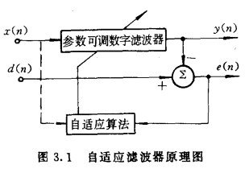

# 数字信号处理

[TOC]

## Z变换
### Z正变换
Z变换对：
$$X(z) = \mathcal{Z}[x(n)] = \sum_{n=-\infty}^{\infty}x[n]z^{-n}$$

### Z反变换
#### 幂级数形式
由Z正变换不难看出，一个时间序列$x(n)$的z变换为一$z^{-1}$的n次多项式，其中每项的系数恰为时间序列对应点的值。通常$X(z)$（符合因果性）都可以展开成这样的形式：

$$X(z) = x[0](z^{-1})^0 + x[1](z^{-1})^1 + x[2](z^{-1})^2 + \cdots$$

这样通过系数可以直接得到原时间序列。

展开的方法可以参考： [长除法](https://baike.baidu.com/item/%E5%A4%9A%E9%A1%B9%E5%BC%8F%E9%95%BF%E9%99%A4%E6%B3%95/18881169?fr=aladdin)

需要注意的是，这种方法得到的是原序列的数值形式，而非解析形式。对于有限长的原序列才比较合适这种方法。

#### 有理分式部分分式分解
Z变换除了幂级数形式非常好反变换，写成这样的形式也可以简单的找到对应的原序列：

$$F(z) = \frac{1}{1-az^{-1}} = \frac{z}{z-a}$$

对应原函数如表：

时域函数$x[n]$ | 频域函数$X[z]$
:-: | :-: | :-:
$$a^n\epsilon[n]$$ | $$\frac{z}{z-a}$$
$$na^{n-1}\epsilon[n]$$ | $$\frac{z}{(z-a)^2}$$ 

通常（有理函数）可以将$F(z)$写成这样的形式，进行部分分式分解得到若干个这样的项：
$$\frac{F(z)}{z} = \frac{B_0}{z} + \frac{B_1}{z-v_1} + \frac{B_2}{z-v_2} + \cdots$$

再两边同乘$z$，得到上述形式项之和。这样就可以转变为简单形式之和从而方便的得到原序列了。

这个展开的方法称作部分分式展开，记有一有理函数$G(z)$，可以写成：

$$G(z) = \frac{N(z)}{D(z)} = \frac{N(z)}{(z-z_1)(z-z_2)\cdots(z-z_n)} = \frac{K_1}{z-z_1} + \cdots + \frac{K_n}{z-z_n}$$

> 在Z变换中，通常先做$G(z) = \dfrac{F(z)}{z}$

这里先讨论$D(z)$无重根的情况。$N(z)$和$D(z)$均为$z$的多项式。需要注意的是为了方便通过变换令$D(z)$的$z^n$项系数为$1$，并且$G(z)$必须为真分式（即分子次数比分母低），否则要先通过长除法将假分式转化为多项式与真分式之和。

部分分式展开的过程即求取待定系数$K_1,K_2,\cdots,K_n$，如果表达式较为简单的话，可以直接用**待定系数法**求解。

下面给出一个求取系数的通用公式。如果对上式左右同乘$(z-z_i)$，有：

$$(z-z_i)\frac{N(z)}{D(z)} = K_i + (z-z_i)\sum_{k\not=i}\frac{K_k}{z-z_k}$$

取$z=z_i$的时候，右边第二项就是$0$了，只剩下$K_i$，因此可以得到无重根项的系数求解公式：

$$K_i = \lim_{z\to z_i}[(z-z_i)\frac{N(z)}{D(z)}]$$

需要注意的是取等只能通过逼近取得，是一个$\dfrac{0}{0}$型不定式，通常该极限要通过洛必达法则求取：

$$\begin{aligned}
    K_i &= \lim_{z\to z_i}[(z-z_i)\frac{N(z)}{D(z)}]\\
    &= \lim_{z\to z_i}\frac{\frac{d}{dz}[(z-z_i)N(z)]}{\frac{d}{dz}[D(z)]}\\ 
    &= \lim_{z\to z_i}[\frac{N(z)}{D'(z)}]
\end{aligned}$$

对于$p$阶重根的项，有相似的思路，左右同乘$(z-z_i)^p$：

$$\begin{aligned}
    (z-z_i)^p\frac{N(z)}{D(z)} &= (z-z_i)^p \left[ \frac{K_{i,p}}{(z-z_i)^p} + \frac{K_{i,p-1}}{(z-z_i)^{p-1}} +\cdots+ \frac{K_{i,1}}{(z-z_i)} + \sum_{k\not=i}\frac{K_k}{z-z_k} \right]\\
    &= K_{i,p} + K_{i,p-1}(z-z_i) +\cdots+ K_{i,1}(z-z_i)^{p-1} + (z-z_i)^p\sum_{k\not=i}\frac{K_k}{z-z_k}
\end{aligned}$$

可见要求得$K_{i,p-j}$只需要对上式两边求$j$次导，由此得到$p$阶重根的项的系数公式：

> $j=0,1,\cdots,p-1$

$$K_{i,p-j} = \lim_{z\to z_i}\left\{
    \frac{1}{j!}
    \frac{d^j}{dz^j}\left[
        (z-z_i)^p\dfrac{N(z)}{D(z)}
        \right]
    \right\}$$

#### 留数法
$$\begin{aligned}
    f(n) = \mathcal{Z}^{-1}[F(z)] &= \frac{1}{2\pi j}\oint_C F(z)z^{n-1}dz \\
    &= \sum_{C内诸极点}\mathrm{Res}[F(z)z^{n-1}]
\end{aligned}$$

其中由复变可知，留数的计算公式为：

$$\mathrm{Res}[F(z)z^{n-1}]\Big|_{z=z_i} = [(z-z_i)F(z)z^{n-1}]\Big|_{z=z_i} $$

对于$p$阶极点，有：

$$\mathrm{Res}[F(z)z^{n-1}]\Big|_{z=z_i} = \frac{1}{(p-1)!}\{\frac{d^{p-1}}{dz^{p-1}}[(z-z_i)F(z)z^{n-1}]\}\Big|_{z=z_i} $$

这形式上与部分分式分解相同。

特别地，如果$n=0$，还会有$z^{n-1}$带来的极点，也需要计算。

> 适合计算某点的值。

### 收敛域
- 不能包含极点，以极点为界。
- 收敛域与序列关系的性质：
    1. $M\leq n \leq N$的有限长序列覆盖整个$z$平面，但有可能要去掉$z=0$或$z=\infty$
    2. $M\leq n < \infty$右边无限长序列在距离原点最远极点的圆外部
    3. $\infty < n \leq N$左边序列在距离原点最近极点的圆内部
    4. 无限长双边序列为环形

### 使用Z变换分析系统性质
#### 稳定性
系统传输函数$H(z)$收敛域包括单位圆，即$H(e^{j\omega})$存在。

如果考虑的是一右边序列（通常都是），进一步有所有极点均在单位圆内。

#### 因果性
系统传输函数$H(z)$收敛域包括$z=\infty$。

这一性质可以如此理解：如果$H(z)$在$z=\infty$处极点，即意味着$H(z)$有因子$z^p$，由上文幂级数性质可知此时原序列$h[n]$在$n<0$时有值。

## 平稳随机信号基础
### 平稳随机，各态遍历
### 自相关函数与互相关函数
定义：

$$R_{xy}(m) = E[x(n)y(n+m)]$$
#### 性质

### 功率谱
维纳-辛钦定理

### 平稳随机信号通过线性系统
有一平稳随机信号$x[n]$，通过线性系统$h[n]$，得到$y[n]$。

有：

$$R_{yy}(m) = R_{xx}(m) \ast h[m] \ast h[-m]$$

$$\begin{aligned}
    P_{yy}(z) &= P_{xx}(z)H(z)H^*(z)\\
    &= P_{xx}(z)H(z)H(z^{-1})\\
    &= P_{xx}(z) |H(z)|^2
\end{aligned}$$

对于$x$和$y$互相关，有（xy顺序？PPT定义？书上定义？）：

$$P_{yx}(z) = P_{xx}(z)H(z)$$

$$P_{xy}(z) = P_{xx}(z)H^*(z)$$

$$P_{xx} \xrightarrow{h(m)} P_{xy} \xrightarrow{h(-m)} P_{yy}$$
## 谱分解
对于任意实平稳随机信号$y_n$的有理功率谱$S_{yy}(z)$可以唯一的表示为：

$$S_{yy}(z) = \sigma_\epsilon^2 B(z)B(z^{-1})$$

其中$B(z)$为一有理函数，满足：

$$B(z) = \frac{N(z)}{D(z)}$$

$N(z)$和$D(z)$均为满足最小相位性质的多项式。$\sigma_\epsilon^2$用以调整常系数使得$N(z)$和$D(z)$最高次系数都为$1$。

### 白噪声通过线性系统
$X(z) = \sigma_\epsilon^2$可以看作是一白噪声的功率谱，$\sigma_\epsilon^2 B(z)B(z^{-1})$可以视作白噪声通过线性系统后的功率谱。

这表明：任何平稳随机信号$y_n$都可以看作是由一个白噪声序列激励稳定因果线性时不变系统$B(z)$产生的输出。

>　最小相位：零点都在单位圆内

## 维纳滤波器
### 问题模型
输入信号$x(n)=s(n)+v(n)$通过系统$h(n)$得到输出$y(n)$。

其中$s(n)$是原信号，$v(n)$是噪声，滤波器的目标是在带噪声的信号中滤出原信号，即使得$y(n)=\hat{s}(n)$。并且有：

$$\hat{s}(n) = x(n)\ast h(n) = \sum_i h(i)x(n-i)$$

定义估计误差：

$$e(n) = s(n) - \hat{s}(n)$$

滤波器应当按照最小均方误差（MMSE）准则最小化误差：

$$\xi(n) = E[e^2(n)]$$

设计维纳滤波器的过程即设计滤波器系数$h(m)$，令：

$$\frac{\partial\xi(n)}{\partial h(m)} = E[2e(n)\frac{\partial e(n)}{\partial h(m)}] = -2E[e(n)x(n-m)] = 0$$

其中
$$E[e(n)x(n-m)] = 0$$

称为正交方程。表明任何时候估计误差都与输入数据正交。

带入前若干式得：

$$E\{\left[s(n)-\sum_i h(i)x(n-i)\right]x(n-m)\} = 0$$

变化即：
$$E[x(n-m)s(n)] = \sum_i h(i)E[x(n-m)x(n-i)]$$

$$R_{xs}(m) = \sum_i h(i)R_{xx}(m-i)$$

> 在姚天任. 数字信号处理理论算法与实现. 第一版. 中式左侧写成了$R_{sx}(m)$，是一个错误。

这个方程称作**维纳-霍夫（Wiener-Hopf）方程**。

### 求解维纳-霍夫方程
维纳-霍夫方程没有规定滤波器$h(i)$的形式，$h(i)$可以取不同取值范围，主要使用的形式有：

1. $0\leq i \leq N-1$，FIR维纳滤波器。
2. $0\leq i < \infty$，因果IIR维纳滤波器。
3. $-\infty < i < \infty$，非因果IIR维纳滤波器。

可用于：

1. 滤波
2. 平滑
3. 预测

#### FIR维纳滤波器
记N阶FIR维纳滤波器冲激响应：

$$\mathbf{h} = [h(0),h(1),\cdots,h(N-1)]^T$$

输入信号为：

$$\mathbf{x}(n) = [x(n),x(n-1),\cdots,x(n-(N-1))]^T$$

记$x(n)$的自相关矩阵为$\mathbf{R}$

$$\mathbf{R} = E[\mathbf{x}(n)\mathbf{x}^T(n)]$$

记$s(n)$与$\mathbf{x}(n)$的互相关矩阵为$\mathbf{P}$

$$\mathbf{P} = E[d(n)\mathbf{x}(n)]$$

维纳-霍夫（Wiener-Hopf）方程可以写作：

$$\mathbf{P} = \mathbf{R}\mathbf{h}$$

解为：

$$\mathbf{h}_{opt} = \mathbf{R^{-1}}\mathbf{P}$$

> 在[自适应滤波](自适应滤波器基本原理)一节中，对相关推导的写法可能更系统一些。基于矩阵微积分。

#### 非因果IIR维纳滤波器
对维纳-霍夫（Wiener-Hopf）方程两边取Z变换：

$$H_{opt}(z) = \frac{S_{sx}(z)}{S_{xx}(z)}$$

最好求。

#### 因果IIR维纳滤波器
如果滤波器的输入是方差为$\sigma_\epsilon^2$白噪声，方程是好求解的，所以如果将输入信号先白化，再设计滤波器，就简单了。

设输入信号转化为方差为$\sigma_\epsilon^2$的白噪声$\epsilon(n)$

$$\begin{aligned}
    H(z) &= \frac{1}{B(z)}G(z) \\
    &= \frac{1}{B(z)}\frac{1}{\sigma_\epsilon^2}[S_{\epsilon s}(z)]_+ \\
    &= \frac{1}{B(z)}\frac{1}{\sigma_\epsilon^2}[\frac{S_{xs}(z)}{B(z^{-1})}]_+
\end{aligned}$$

1. 白化

    $B(z)$是一个白化滤波器，对输入信号自功率谱$S_{xx}(z)$做谱分解得到：

    $$S_{xx}(z) = \sigma_\epsilon^2B(z)B(z^{-1})$$

2. 和分解，取因果部分

    $$\frac{S_{xs}(z)}{B(z^{-1})} = [\frac{S_{xs}(z)}{B(z^{-1})}]_- + [\frac{S_{xs}(z)}{B(z^{-1})}]_+$$

3. 逆Z变换，求冲激响应

### 给定模型的因果IIR维纳滤波器
对于有：

$$s(n) = as(n-1) + w(n)$$

$$x(n) = cs(n) + v(n)$$

的模型，其中$w(n)$是信号模型中的白噪声激励，方差为$Q$；$v(n)$是信号传输或测量中引入的加性白噪声，方差为$R$。$a,c<1$

这个模型是一阶AR模型，有：

$$S_{ss}(z) = \frac{Q}{(1-az^{-1})(1-az)}$$

对于一些功率谱，有如下特征：

$$S_{xs}(z) = \frac{cQ}{(1-az^{-1})(1-az)}$$

$$S_{xx}(z) = \frac{c^2Q}{(1-az^{-1})(1-az)} + R$$

按照因果IIR维纳滤波器的设计流程，有：

1. 谱分解
    
    $$\begin{aligned}
        S_{xx}(z) &= \frac{c^2Q + (1+a^2)R - aRz^{-1} - aRz}{(1-az^{-1})(1-az)}\\
        &= \sigma_\epsilon^2\frac{(1-fz^{-1})}{(1-az^{-1})}\frac{(1-fz)}{(1-az)}
    \end{aligned}$$

    待定系数$\sigma_\epsilon^2$、$f$

    解为：

    $$\left\{\begin{aligned}
        f &= \frac{Ra}{R+c^2P} \\
        \sigma_\epsilon^2 &= R+c^2P
    \end{aligned}\right.$$

    $P$是Ricatti方程$Q = P - \dfrac{PRa^2}{R+c^2P}$的正解

2. 取因果部分

    $$\begin{aligned}
        \frac{S_{xs}(z)}{B(z^{-1})} &= \frac{cQ}{(1-az^{-1})(1-az)} \Big/ \frac{(1-fz)}{(1-az)}\\
        &= \frac{cQ}{((1-az^{-1})(1-fz)} \\
        &= \frac{A}{1-az^{-1}} + \frac{Bz}{1-fz}
    \end{aligned}$$

    待定系数求得$A = \dfrac{cQ}{1-fa}$，有：
    
    $$[\frac{S_{xz}(z)}{B(z^{-1})}]_+ = \frac{\sigma_\epsilon^2G}{1-az^{-1}}$$

    其中$G = \dfrac{cQ}{\sigma_\epsilon^2(1-fa)}$，称为*维纳增益*。

最终求得：

$$H_c(z) = \frac{G}{1-fz^{-1}}$$
### 维纳滤波器的均方误差
一个感兴趣的问题是滤波器已经得到最优解$h_{opt}$后，最小的均方误差$\xi_{min}$是什么。

#### FIR
直接带入计算：

$$\xi_{min}(n) = E[s^2(n)] - \mathbf{P}^T\mathbf{w}^*$$

#### IIR
通常设计得出$H_{opt}$

最优时有

$$\xi_{min}(n) = E[e(n)s(n)] = R_{es}(0)$$

反变换$S_{es}(z)$

$$\begin{aligned}
    \xi_{min}(n) &= \frac{1}{2\pi j}\oint S_{es}(z) z^{0-1}dz \\
    \xi_{min}(n) &= \frac{1}{2\pi j}\oint [S_{ss}(z) - H_{opt}(z)S_{xs}(z^{-1})] z^{-1}dz
\end{aligned}$$

围线$C$取单位圆

> 但是为什么？

### 卡尔曼滤波器
先做一些符号规定：

$$\hat{s}(n|n) \rightarrow \hat{s}(n)$$

$$\hat{s}(n-1|n-1) \rightarrow \hat{s}(n-1)$$

由上节因果IIR维纳滤波器：

$$H_c(z) = \frac{G}{1-fz^{-1}},f=a(1-cG)$$

$$\begin{aligned}
    \hat{s}(n|n) &= f\hat{s}(n-1|n-1) + Gx(n)\\
    &= a\hat{s}(n-1|n-1) + G[x(n)-ac\hat{s}(n-1|n-1)]
\end{aligned}$$

用$n-1$时$s(n)$的最佳线性估计$\hat{s}(n-1|n-1)$得到……

## 自适应滤波器
### 自适应滤波器基本原理
自适应滤波是维纳滤波器的发展/推广，可以在工作中逐渐估计所需的统计特性。

$d(n)$称为参考信号，是自适应滤波器的输入之一，有：

$$e(n) = d(n)-y(n)$$

自适应滤波器的目标依然是最小化误差。

记$L+1$长的输入信号：

$$\mathbf{x}(n) = [x(n),x(n-1),\cdots,x(n-L)]^T$$

对于单输入的自适应滤波器，其有$L+1$个参数构成权系数矢量：

$$\mathbf{w}(n) = [w_0(n),w_1(n),\cdots,w_L(n)]^T$$

输出为：

$$y(n) = \mathbf{x}^T(n)\mathbf{w}(n) = \mathbf{w}^T(n)\mathbf{x}(n)$$

均方误差为：

$$\begin{aligned}
    \xi(n) &= E[e^2(n)] = E[d^2(n)+y^2(n)-2d(n)y(n)]\\
    &= E[d^2] + E[(\mathbf{w}^T\mathbf{x})^2] - 2E[d\mathbf{w}^T\mathbf{x}] + E[(\mathbf{w}^T\mathbf{x})^2] \\
    &= E[d^2] + \mathbf{w}^TE[\mathbf{x}\mathbf{x}^T]\mathbf{w} - 2E[d\mathbf{x}^T]\mathbf{w}
\end{aligned}$$

如果记$x(n)$的自相关矩阵为$\mathbf{R}$

$$\mathbf{R} = E[\mathbf{x}(n)\mathbf{x}^T(n)]$$

记$d(n)$与$\mathbf{x}(n)$的互相关矩阵为$\mathbf{P}$

$$\mathbf{P} = E[d(n)\mathbf{x}(n)]$$

$$\xi(n;\mathbf{w}) = E[d^2(n)] + \mathbf{w}^T\mathbf{R}\mathbf{w} - 2\mathbf{P}^T\mathbf{w}$$

> 这里转不转置定义比较乱，但是应该没错。

这在参数空间$(\xi,w_0,w_1,\cdots,w_L)$称作均方误差性能曲面。

求梯度：

$$\nabla\xi = 2\mathbf{R}\mathbf{w}-2\mathbf{P} = 0$$

可以解出最优参数：

$$\mathbf{w}^* = \mathbf{R}^{-1}\mathbf{P}$$

这称作最佳权矢量或维纳解，与FIR维纳滤波器的解一致。

> 但是矩阵求逆计算很复杂，所以有以下多种改进方法。

### 性能曲面
在空间$(\xi,w_0,w_1,\cdots,w_L)$中，等高线（定误差）有：

$$\mathbf{w}^T\mathbf{R}\mathbf{w} - 2\mathbf{P}^T\mathbf{w} = \text{常数}$$

将原点平移到$\mathbf{w}^*$，得到权偏移矢量坐标系：

$$\mathbf{v} = \mathbf{w}-\mathbf{w}^*$$

$$F(\mathbf{v}) = \mathbf{v}^T\mathbf{R}\mathbf{v} = \text{常数}$$

有

$$\begin{aligned}
    \nabla F &= 2\mathbf{R}\mathbf{v}\\
    &= 2\mathbf{R}(\mathbf{w}-\mathbf{w}^*)\\
    &= 2\mathbf{R}(\mathbf{w}-\mathbf{R}^{-1}\mathbf{P})\\
    &= 2\mathbf{R}\mathbf{w}-2\mathbf{P} = \nabla\xi
\end{aligned}$$

**主轴**$\mathbf{v}'$通过原点，形式为$\mu\mathbf{v'}$；与椭圆$F(\mathbf{v})$正交的矢量可以用$\nabla F$表示，有：

$$2\mathbf{R}\mathbf{v}' = \mu \mathbf{v}'$$

$$(\mathbf{R} - \frac{\mu}{2})\mathbf{v}' = 0$$

这与$\mathbf{R}$的特征矢量等式的形式一致：

$$(\mathbf{R}-\lambda_n\mathbf{I})\mathbf{Q}_n = 0$$

**说明主轴$\mathbf{v}'$是$\mathbf{R}$的特征矢量。**

将$\mathbf{R}$对角化：

$$\mathbf{R} = \mathbf{Q} \Lambda \mathbf{Q}^{-1}$$

$$\Lambda = \mathrm{diag}(\lambda_0,\lambda_1,\cdots,\lambda_L)$$

$$\mathbf{Q} = [\mathbf{Q}_0,\mathbf{Q}_1,\cdots,\mathbf{Q}_L]$$

分别为特征值和特征向量阵。

这表明进行变换

$$\mathbf{v}' = \mathbf{Q}^T\mathbf{v} = \mathbf{Q}^{-1}\mathbf{v}$$

后

$$\nabla\xi = 2\Lambda\mathbf{v}' = 2[\lambda_0 v_0',\cdots,\lambda_L v_L']^T$$

这个操作通过旋转将坐标轴变换到主轴上。

二次性能曲面的性质可以总结为：

- 输入信号自相关矩阵$\mathbf{R}$的特征矢量阵确定了主轴。
- 旋转坐标系统$\mathbf{v}'$确定了性能曲面等高线（一组同心超椭圆）的主轴坐标系统。
- $\mathbf{R}$的特征值是特征曲面沿主轴的二阶导数。

### GD
$$\mathbf{w}^{(t+1)} = \mathbf{w}^{(t)} - \mu\nabla\xi(n)$$

假设迭代计算频率与采样频率相同，变为：

$$\mathbf{w}(n+1) = \mathbf{w}(n) - \mu\nabla\xi(n)$$

#### 稳定性、收敛速度
分析收敛性：略

第$n$步的权值：

$$\mathbf{w}(n) = \mathbf{w}^*  + (\mathbf{I}-2\mu\mathbf{R})^n[\mathbf{w}(0)-\mathbf{w}^*]$$

最低误差：

$$\xi_{min} = E[d^2[n]]-\mathbf{P}^T\mathbf{W}^*$$

学习曲线时间常数$\tau_{mse}$：

$$(r_{mse})_k = r_k^2 = (1-2\mu\lambda_k)^2$$

误差下降到：

$$\frac{\xi(n)-\xi_{min}}{\xi(0)-\xi_{min}} = r_{mse}^n$$

$$r_{mse}^{\tau_{mse}} = e^{-1}$$

时

$$(\tau_{mse})_k = \frac{1}{4\mu\lambda_k}$$

### LMS
最小均方（LMS）算法，不要求脱线计算。

用平方误差估计均方误差，有：

$$\begin{aligned}
    \nabla\xi &\approx \frac{\partial}{\partial\mathbf{w}}(e^2(n))\\
    &= 2e(n)\frac{\partial(d(n)-\mathbf{w}^T\mathbf{x})}{\partial\mathbf{w}} \\
    &= -2e(n)\mathbf{x}(n)
\end{aligned}$$

#### 权矢量噪声
用这个方法估计是存在误差/噪声的：

$$\mathrm{cov}[\mathbf{v}(n)] \approx \mu\xi_{min}\mathbf{I}$$
#### 失调量

失调量$M$：

$$M = \frac{\text{超量MSE}}{\xi_{min}} \approx \mu\mathrm{tr}(\mathbf{R})$$

$$\mathrm{tr}(\mathbf{R})$$

失调量、学习曲线时间常数是折衷

### RLS
自适应递归最小二乘方（RLS）算法：

用时间平均的最小化准则替代均方误差。对于误差信号增加遗忘因子$\lambda$，误差函数为：

$$\epsilon(n) = \sum_{k=0}^{n}\lambda^{n-k}e^2(k)$$

> 对于非平稳信号，更好的进行跟踪。

求梯度，令：

$$\begin{aligned}
    \nabla\epsilon(n) &= \sum_{k=0}^{n}\lambda^{n-k} \cdot 2 e(k)\frac{\partial(d(k)-\mathbf{x}^T\mathbf{w})}{\partial\mathbf{w}}\\
    &= -2\sum_{k=0}^{n}\lambda^{n-k}[d(k)-\mathbf{x}^T\mathbf{w}]\mathbf{x} = 0
\end{aligned}$$

得到：

$$[\sum_{k=0}^{n}\lambda^{n-k}\mathbf{x}\mathbf{x}^T]\mathbf{w} = \sum_{k=0}^{n}\lambda^{n-k}d(k)\mathbf{x}$$

记：

$$\mathbf{R}(n) = \sum_{k=0}^{n}\lambda^{n-k}\mathbf{x}\mathbf{x}^T$$

$$\mathbf{P}(n) = \sum_{k=0}^{n}\lambda^{n-k}d(k)\mathbf{x}$$

正交方程变为：

$$\mathbf{R}\mathbf{w} = \mathbf{P}$$

最小二乘方准则的维纳解为：

$$\mathbf{w}^* = \mathbf{R}^{-1}\mathbf{P}$$

## 现代谱估计 
### 经典谱估计
实际操作中对于平稳随机信号只能观察到若干有限个取样值：

$$x_N(n) = \{x(0),x(1),\cdots,x(N)\}$$

由此对自相关函数进行估计：

$$\hat{R}_{xx}(m) = \frac{1}{N}\sum_{n=0}^{N-1-|m|}x(n)x(n+m)$$

这是一种渐进无偏估计，称之为取样自相关函数。

由维纳-辛钦定理，经过傅里叶变换（指DFT）得到功率谱估计：

$$\hat{S}_{xx}(\omega) = \frac{1}{N}|X(e^{jw})|^2$$

这个方法的问题是：

1. 频率分辨率不高
2. 有限样本等效于加窗，导致频谱泄漏

### 参数模型
相比于经典谱估计，现代谱估计先验地假设随机信号由一定的模型产生。这个想法由[谱分解](#白噪声通过线性系统)带来的知识支撑。

设随机信号由一个均值为零、方差为$\sigma^2$的白噪声$u(n)$通过一线性系统$H(z)$产生，$H(z)$有：

$$H(z) = \frac{B(z)}{A(z)} = \frac{\displaystyle{\sum_{n=0}^{q}b_nz^{-n}}}{\displaystyle{\sum_{n=0}^{p}a_nz^{-n}}}$$

输出信号$x(n)$的功率谱为：

$$\begin{aligned}
    S_{xx}(z) &= \sigma^2H(z)H^*(\frac{1}{z^*}) = \sigma^2\frac{B(z)B^*(\frac{1}{z^*})}{A(z)A^*(\frac{1}{z^*})}
\end{aligned}$$

通常系统冲激响应$h(z)$是实信号，有：

$$S_{xx}(z) = \sigma^2H(z)H(z^{-1}) = \sigma^2\frac{B(z)B(z^{-1})}{A(z)A(z^{-1})}$$

不失一般性，可以调整系数使$a_0=1$，$b_0=1$。

根据$H(z)$性质的不同，可以分为几种不同的模型：

#### MA(q)模型
除了$a_0=1$，其他$a_i$均为零。

称为$q$阶滑动平均模型（Moving-Average, MA），是全零点模型。

$$H_{MA}(z) = B(z)$$

#### AR(p)模型
除了$b_0=1$，其他$b_i$均为零。

称为$p$自回归模型（Auto-regressive, AR），是全极点模型。

$$H_{AR}(z) = \frac{1}{A(z)}$$

#### ARMA(p,q)模型
所有$a_i$，$b_i$不全为零。

#### 模型之间转化
- Wold分解定理：
    任意ARMA过程或AR过程可以用一个无限长MA过程表示。

- Kolmogorov定理：
    任意ARMA过程或MA过程可以用一个无限长AR过程表示。

通常AR模型好解。

### AR模型谱估计
对于$p$阶AR模型，有$p$个AR系数。

由

$$H_{AR}(z) = \frac{1}{A(z)} = \frac{1}{1+\displaystyle{\sum_{k=1}^{p}a_kz^{-k}}}$$

输出为：

$$x(n) = -\sum_{k=1}^{p}a_kx(n-k) + u(n)$$

1. 逆Z变换法

根据AR模型：

$$u(n) \longrightarrow H(z)=\frac{1}{A(z)} \longrightarrow x(n)$$

由此有：

$$S_{xx} = \frac{\sigma^2}{A(z)A(z^{-1})}$$

略作变换，得到：

$$A(z)S_{xx} = \frac{\sigma^2}{A(z^{-1})}$$

$$S_{xx} = \frac{\sigma^2}{A(z^{-1})} + (1-A(z))S_{xx}$$

$$S_{xx} = \frac{\sigma^2}{A(z^{-1})} + \sum_{k=1}^{p}a_kS_{xx}z^{-k}$$

两遍逆Z变换，得到：

$$R_{xx}(m) = \sum_{k=0}^{p}\sigma^2\delta(m+k) + \sum_{k=1}^{p}a_kR_{xx}(m-k)$$

由于是因果信号，去掉$m<0$的冲激，得到：

$$R_{xx}(m) = \delta(m) + \sum_{k=1}^{p}a_kR_{xx}(m-k)$$

Yule-Walker方程：

$$R_{xx}(m) = \left\{\begin{aligned}
    &-\sum_{k=1}^{p}a_kR_{xx}(m-k) + \sigma^2, &m=0\\
    &-\sum_{k=1}^{p}a_kR_{xx}(m-k), &m>0
\end{aligned}\right.$$

矩阵形式：

$$\begin{bmatrix}
    R(0) & R(1) & \cdots & R(p)\\
    R(1) & R(2) & \cdots & R(p-1)\\
    \vdots & \vdots &\ddots &\vdots\\
    R(p) & R(p-1) & \cdots & R(0) 
\end{bmatrix}
\begin{bmatrix}
1 \\ a_1 \\ \vdots \\ a_p
\end{bmatrix}
=\begin{bmatrix}
\sigma^2 \\ 0 \\ \vdots \\ 0
\end{bmatrix}
$$

#### Levinson-Durbin算法
Levinson算法：由AR(k)模型参数迭代计算AR(k+1)的参数。

已知$k$阶参数$\{a_{k,1},a_{k,2},\cdots,a_{k,k},\sigma_k^2\}$，对其Yule-Walker方程增广，增加一列和一行

$$\begin{bmatrix}
    R(0) & R(1) & \cdots & R(k) & R(k+1)\\
    R(1) & R(2) & \cdots & R(k-1) & R(k)\\
    \vdots & \vdots &\ddots &\vdots & \vdots\\
    R(k) & R(k-1) & \cdots & R(0) & R(1)\\
    R(k+1) & R(k) & \cdots & R(1) & R(0)
\end{bmatrix}
\begin{bmatrix}
1 \\ a_{k,1} \\ \vdots \\ a_{k,k} \\ 0
\end{bmatrix}
=\begin{bmatrix}0
\sigma_k^2 \\ 0 \\ \vdots \\ 0 \\ D_k
\end{bmatrix}
$$

其中$D_k$为

$$D_k = \sum_{i=0}^{k}a_{k,i}R(k+1-i),\quad a_{k,0}=1$$

对比$k+1$阶的Yule-Walker方程：

$$\begin{bmatrix}
    R(0) & R(1) & \cdots & R(k) & R(k+1)\\
    R(1) & R(2) & \cdots & R(k-1) & R(k)\\
    \vdots & \vdots &\ddots &\vdots & \vdots\\
    R(k) & R(k-1) & \cdots & R(0) & R(1)\\
    R(k+1) & R(k) & \cdots & R(1) & R(0)
\end{bmatrix}
\begin{bmatrix}
1 \\ a_{k+1,1} \\ \vdots \\ a_{k+1,k} \\ a_{k+1,k+1}
\end{bmatrix}
=\begin{bmatrix}
\sigma_{k+1}^2 \\ 0 \\ \vdots \\ 0 \\ 0
\end{bmatrix}
$$

将增广的$k$阶方程行列倒序，左式左侧项不变。倒序后与倒序前线性组合得到：

$$\begin{bmatrix}
1 \\ a_{k+1,1} \\ \vdots \\ a_{k+1,k} \\ a_{k+1,k+1}
\end{bmatrix} = 
\begin{bmatrix}
1 \\ a_{k,1} \\ \vdots \\ a_{k,k} \\ 0
\end{bmatrix}-\gamma_{k+1}
\begin{bmatrix}
0 \\ a_{k,k} \\ \vdots \\ a_{k,1} \\ 1
\end{bmatrix}
$$

$\gamma_{k+1}$称为反射系数。

又有：

$$\begin{bmatrix}
\sigma_{k+1}^2 \\ 0 \\ \vdots \\ 0 \\ 0
\end{bmatrix} =
\begin{bmatrix}
\sigma_k^2 \\ 0 \\ \vdots \\ 0 \\ D_k
\end{bmatrix}-\gamma_{k+1}
\begin{bmatrix}
D_k \\ 0 \\ \vdots \\ 0 \\ \sigma_k^2 
\end{bmatrix}
$$

得到：

$$\gamma_{k+1} = \frac{D_k}{\sigma_k^2}$$

$$\sigma_{k+1}^2 = \sigma_k^2-\gamma_{k+1}D_k = (1-\gamma_{k+1}^2)\sigma_k^2$$

对于$p$阶模型，递推到指定阶数就行。

### 格型滤波器
前向预测 后向预测

AR(k)模型参数为一个序列：

$$A_k(z) = \sum_{i=0}^{k}a_{k,0}z^{-i},a_{k,0}=1$$

倒序多项式为：

$$A_k^R(z) = z^{-k}A_k(z^{-1})$$

在Levinson-Durbin算法中，递推公式可以写为：

$$A_{k+1}(z) = A_k(z) - \gamma_{k+1}z^{-1}A_k^R(z)$$

$$A_{k+1}^R(z) = z^{-1}A_k^R(z) - \gamma_{k+1}A_k(z)$$

写成矩阵形式：

$$\begin{bmatrix}
A_{k+1}(z)\\A_{k+1}^R(z)
\end{bmatrix} = 
\begin{bmatrix}
1 & -\gamma_{k+1}z^{-1} \\
-\gamma_{k+1} & z^{-1}
\end{bmatrix}
\begin{bmatrix}
A_k(z)\\A_k^R(z)
\end{bmatrix}
$$

前向预测误差，$a_{k,0}=1$：

$$\begin{aligned}
    e_k^+(n) &= \sum_{i=0}^{k} a_{k,i}x(n-i)\\
    &= x(n) - [-\sum_{i=i}^{k} a_{k,i}x(n-i)] \\
    &= x(n) - \hat{x}(n)
\end{aligned}$$

$$E_k^+(z) = A_k(z)X(z)$$

后向预测误差：

$$e_k^+(n) = \sum_{i=0}^{k} a_{k,k-i}x{n-i},a_{k,0}=1$$

$$E_k^+(z) = A_k^R(z)X(z)$$

可见误差与模型参数有对应关系：

$$\begin{bmatrix}
E_{k+1}^+(z)\\E_{k+1}^-(z)
\end{bmatrix} = 
\begin{bmatrix}
1 & -\gamma_{k+1}z^{-1} \\
-\gamma_{k+1} & z^{-1}
\end{bmatrix}
\begin{bmatrix}
E_k^+(z)\\E_k^-(z)
\end{bmatrix}
$$

对应时域关系式：

$$\begin{bmatrix}
e_{k+1}^+(n)\\e_{k+1}^-(n)
\end{bmatrix} = 
\begin{bmatrix}
1 & -\gamma_{k+1} \\
-\gamma_{k+1} & 1
\end{bmatrix}
\begin{bmatrix}
e_k^+(n)\\e_k^-(n-1)
\end{bmatrix}
$$

### 白噪声中正弦频率的估计

对于有$M$个复正弦波的模型，是AR和MA参数相同的特殊的ARMA(M,M)

- 在低信噪比情况下，AR谱估计结果不理想，为了提
高谱估计结果的精度，要降低噪声的影响。

## 线性预测编码（LPC）分析
未知序列$e(n)$激励未知系统$V(z) = \dfrac{G(z)}{A(z)},a_0=1$得到已知序列$s(n)$。

令$G(z) = 1$，为P阶AR模型。

$s(n)$满足：

$$s(n) = -\sum_{i=1}^{P}\alpha_i s(n-i) + Ge(n)$$

有$P'$阶的预测器，目标预测值：

$$\hat{S}(n) = -\sum_{i=1}^{P'}\alpha_i s(n-i)$$

预测误差：

$$\epsilon(n) = s(n) - \hat{s}(n) = s(n) + \sum_{i=1}^{P'}\alpha_i s(n-i)$$

$$\begin{aligned}
    \sigma_\epsilon^2 &= \sum_{n} \epsilon^2(n) \\
    &= \sum_{n} \left\{s^2(n) + 2s(n)\sum_{i=1}^{P'}\alpha_i s(n-i) + [\sum_{i=1}^{P'}\alpha_i s(n-i)]^2  \right\} \\
    &= \sum_{n}\left\{s^2(n)\right\} + 2\sum_{i=1}^{P'}\alpha_i \left\{ \sum_{n}s(n)s(n-i)\right\} + \sum_{i=1}^{P'}\sum_{j=1}^{P'}\alpha_i\alpha_j \left\{  \sum_{n} s(n-i)s(n-j) \right\}
\end{aligned}$$

要MMSE，必须满足其一
- $P' = P$，$\hat{\alpha}_i = \alpha_i$
- $P' > P$，超出的部分$\hat{\alpha}_i=0$

求

$$\nabla\sigma_\epsilon^2 = 0$$

令$\phi(i,j) = \sigma_{n}s(n-i)(n-j)$

改写为：

$$\begin{aligned}
    \sigma_\epsilon^2 = \sum_{n}\left\{s^2(n)\right\} + 2\sum_{i=1}^{P'}\alpha_i \phi(0,i) + \sum_{i=1}^{P'}\sum_{j=1}^{P'}\alpha_i\alpha_j\phi(i,j)
\end{aligned}$$

求导：

$$\frac{\partial \sigma_\epsilon^2}{\partial \alpha_i}=
2\phi(0,i) + 2\sum_{j=1}^{P'}\alpha_j\phi(i,j) = 0
$$

得到

$$\left\{\begin{aligned}
    \sum_{j=1}^{P'}\alpha_j\phi(i,j) = -\phi(0,i)\\
    \cdots \\
    \cdots
\end{aligned}\right.
\quad k=1,2,\cdots,P $$

## 附录
### 计算复杂度
- 高斯消元法解线性方程组：$p^3$
- Toeplitz矩阵求解：$p^2$

### 矩阵微积分