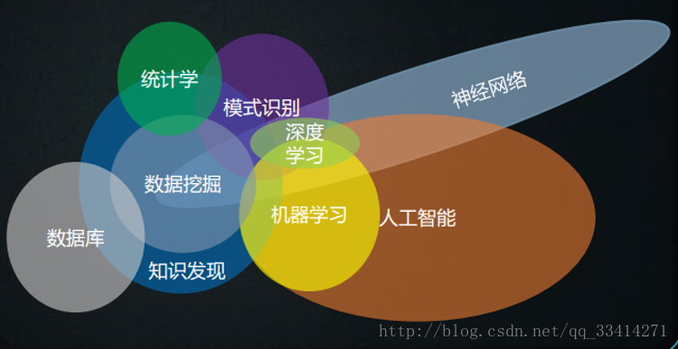
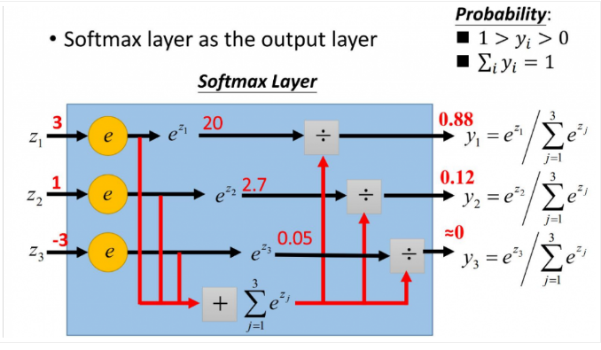

# 模式识别

- [模式识别](#模式识别)
    - [线性判别函数基础理论](#线性判别函数基础理论)
      - [一种线性判别函数的参数训练算法](#一种线性判别函数的参数训练算法)
        - [修正权向量的几何意义](#修正权向量的几何意义)
  - [对数几率回归（Logistic Regression）](#对数几率回归logistic-regression)
    - [回顾线性回归](#回顾线性回归)
    - [对数几率回归（Logistic Regression）](#对数几率回归logistic-regression-1)
      - [Logistic回归的参数估计](#logistic回归的参数估计)
    - [Softmax](#softmax)
  - [从感知器到神经网络](#从感知器到神经网络)
    - [感知器](#感知器)
      - [XOR problem](#xor-problem)
    - [多层感知机(MLP)](#多层感知机mlp)
      - [激活函数](#激活函数)
      - [损失函数（Loss function)](#损失函数loss-function)
    - [训练多层感知机：后向传播（BP）](#训练多层感知机后向传播bp)
  - [支持向量机（SVM, Support Vector Machine）](#支持向量机svm-support-vector-machine)
    - [线性SVM](#线性svm)
      - [点到超平面的距离](#点到超平面的距离)
  - [多分类问题](#多分类问题)
    - [OvR(One vs. Rest)：$\omega_i/\bar{\omega_i}$二分类法](#ovrone-vs-restomega_ibaromega_i二分类法)
    - [OvO(One vs. One)：$\omega_i/\omega_j$二分类法](#ovoone-vs-oneomega_iomega_j二分类法)
      - [OvO的一种特例的等价表达](#ovo的一种特例的等价表达)
    - [MvM()](#mvm)
  
### 线性判别函数基础理论
线性判别函数是一个线性函数，可以将一类样本进行**二分类**。

线性判别函数可以将一系列样本划分为为$\omega_+$和$\omega_-$两类。记一个d维空间中**模式向量**（样本）为$\boldsymbol{x}_i=[x_{i1},x_{i2},\cdots,x_{id}]^T$，**权向量**$\boldsymbol{w}=[w_1,w_2,\cdots,w_d]^T$，有线性判别函数$d(\boldsymbol{x}_i)=w_1x_{i1} + w_2x_{i2} + \cdots +w_dx_{id} + b$。

那么有：

$$\displaystyle{
    d(\boldsymbol{x}_i) = \boldsymbol{w}^T\boldsymbol{x} +b
    \left\{\begin{aligned}
    &> 0, \, \boldsymbol{x} \in \omega_+\\
    &\leq 0,\, \boldsymbol{x} \in \omega_-
    \end{aligned}\right.
}$$

#### 一种线性判别函数的参数训练算法
~~我也不知道课程PPT上为什么这里叫做感知器算法，尽管他还没有发展到真正意义上的感知器（Percetron）。~~
为了方便将最后的这个常数项$b$也写成统一的形式，可以将模式向量和权向量写成增广形式，即增广模式向量：

$$x=[x_1,x_2,\cdots,x_n,1]^T$$

增广权向量：
$$w=[w_1,w_2,\cdots,w_n, b]^T$$
感知器算法是通过对已知样本的训练和学习来求得线性判别函数系数的方法。我们知道对于一个模式向量$x$，应该有：

$$\displaystyle{
    d(x) = w^Tx 
    \left\{\begin{aligned}
    &> 0, \, x \in \omega_1\\
    &\leq 0,\, x \in \omega_2
    \end{aligned}\right.
}$$

现在对于训练样本集中的样本$x_k$进行训练求解权向量。记$w_{(i)}$为第$i$步迭代时的权向量，若$x_k \in \omega_1$，但$w_{(i)}^T x_k \leq 0$，说明分类器分类错误，下一步迭代中的权向量应修正为：

$$w_{(i+1)} = w_{(i)} + Cx_k$$

$C$为校正增量。

若$x_k \in \omega_2$，但$w_{(i)}^T x_k > 0$，同样分类错误，权向量应修正为：

$$w_{(i+1)} = w_{(i)} - Cx_k$$

若分类正确，则权向量保持不变，为：

$$w_{(i+1)} = w_{(i)}$$

现在对$x_k^{'} \in \omega_2$的样本乘以$(-1)$，有$w_{(i)}^T(-x_k^{'}) < 0$时分类错误，此时权向量修正为：

$$w_{(i+1)} = w_{(i)} + C(-x_k^{'})$$

令$x_k=-x_k^{'}$，可以得到统一的感知器算法表达式：

$$\displaystyle{
    w_{(i+1)} =
    \left\{\begin{aligned}
    &w_{(i)} &, &w_{(i)}^Tx_k > 0\\
    w_{(i)} &+ Cx_k &, &w_{(i)}^Tx_k \leq 0
    \end{aligned}\right.
}$$

##### 修正权向量的几何意义

## 对数几率回归（Logistic Regression）

### 回顾线性回归
回归（Regression）是研究两组变量之间关系的统计分析方法。在线性回归（Linear Regression）中我们要做的就是通过一组（$m$个）已知样本$\displaystyle{\{ (\boldsymbol{x}_1,y_1), (\boldsymbol{x}_2,y_2), \cdots, (\boldsymbol{x}_m,y_m) \}}$求得线性模型的最佳（某种意义上的）参数估计值$(w^*,b^*)$，以尽可能准确的预测输出。

记一个$d$维空间中的某一个样本为$\boldsymbol{x}_i=[x_{i1},x_{i2},\cdots,x_{id}]^T$，样本共有$m$个，权向量$\boldsymbol{w}=[w_1,w_2,\cdots,w_d]^T$，线性回归模型为：

$$\displaystyle{\begin{aligned}
    f(x_i) &= w_1x_{i1} + w_2x_{i2} + \cdots +w_dx_{id} + b\\
    &= \boldsymbol{w}^T\boldsymbol{x}+b \simeq y_i
\end{aligned}}$$

参数估计值$(\boldsymbol{w}^*,b^*)$可以用最小二乘法（Least squared method），有均方误差$E$，求$(\boldsymbol{w}^*,b^*)$使其最小，即：

$$\displaystyle{
    E(\boldsymbol{w},b)=\sum_{i=1}^{m}(f(x_i)-y_i)^2
}$$

$$\displaystyle{
    (w^*,b^*) = \mathop{\argmin}\limits_{\boldsymbol{w},b} E(\boldsymbol{w},b)
}$$

$\boldsymbol{w}^*$和$b^*$是有闭式（closed-form）解的。求解:

$$\displaystyle{\begin{aligned}
    \frac{\partial{E}}{\partial{w}}
\end{aligned}}$$

### 对数几率回归（Logistic Regression）
如果我们希望回归完成的不是$f:\boldsymbol{x_i} \rightarrow y_i$，而是与$y$相关的信息。比如如果有两类$\omega_+,\omega_-$，有

$$\left\{\begin{aligned}
  &\boldsymbol{x_i} \in \omega_+ , &y_i>0 \\
  &\boldsymbol{x_i} \in \omega_- , &y_i<0
\end{aligned}\right.$$

我们希望将$(-\infty,\infty)$的值压缩成两个标签$\{0,1\}$上

$$\left\{\begin{aligned}
  &\boldsymbol{x_i} \in \omega_+, &f(\boldsymbol{x}_i)=1 \\
  &\boldsymbol{x_i} \in \omega_-, &f(\boldsymbol{x}_i)=0
\end{aligned}\right.$$

当$x_i$属于正类时，输出值为1；当$x_i$属于负类时，输出值为0（临界值任意判别），我们可以寻找一个新的函数使标签$y=g(z)=g(\boldsymbol{w}^T\boldsymbol{x}+b)$，有$y \in \{0,1\}$。该模型称为广义线性模型，$g(\cdot)$称为联系函数。

一个比较容易想到的的能完成上述任务的函数是：

$$\displaystyle{
    g(y) = \frac{1}{2}sgn(x)+\frac{1}{2} =
    \left\{\begin{aligned}
    &1 , &y>0 \\
    &0.5 , &y=0 \\
    &0 , &y<0
    \end{aligned}\right.
}$$

但是这个函数不连续可微，让我们之前进行参数估计的方法失效了。因此我们退求其次，寻找一类特征接近单位阶跃函数的替代函数（surrogate function），使得$f(\boldsymbol{x}_i)$的输出值尽量接近0或者1。一个可选的函数是Logistic函数：

$$logistic(y)=\frac{1}{1+e^{-y}}$$

Logicstic函数是一种Sigmoid函数[^sigmoid]。最终得到对数几率回归[^对数几率回归]（Logistic Regression）形式：

$$f(\boldsymbol{x}_i)=\frac{1}{1+e^{-\boldsymbol{w}^T \boldsymbol{x}_i+b}}$$

[^sigmoid]:Sigmoid即S形函数。
[^对数几率回归]:译名来自周志华《机器学习》。图也是。

Logistic Regression说是回归（Regression），实际上用作分类（Classification）。

> #### Logistic?Logic?Logit?
> 记$\displaystyle{y=f(\boldsymbol{x}_i)=\frac{1}{1+e^{-\boldsymbol{w}^T \boldsymbol{x}_i+b}}}$，有：
> 
> $$ln\frac{y}{1-y}=\boldsymbol{w}^T \boldsymbol{x} + b$$
> 
> 当$y \rightarrow 1$（注意现在$y$实际上是上文中的标签$z$），意味着$\boldsymbol{x}$更可能属于$\omega_+$，那么$y$可以> 视作样本$\boldsymbol{x}$为正类的可能性，反之$1-y$就是负类的可能性，二者的比值
> 
> $$\frac{y}{1-y}$$
> 
> 称作几率（odds），取对数之后
> 
> $$ln\frac{y}{1-y}$$
> 
> 即为对数几率（log odds, 亦logit）。可见Logistic来源于Logit，与Logic毫无关系，所以译作“逻辑回归”是存在谬误的。

#### Logistic回归的参数估计

### Softmax
如果有多个类需要区分，那么此时用Logistic函数就不足以满足需求了，需要用Softmax函数。假设有$m$个类别需要区分，有一组（$m$个）softmax函数。与Logistic函数相同，我们依然希望输出值接近0或者1，其中1表示属于该类，0表示不属于该类。有输入$z_1,zy_2,\cdots,z_m$，通常输入为一组线性函数，有

$$z_i = \sum_{j=1}^{m} w_{ij} x_{ij}$$

第$i$个softmax函数为：

$$\displaystyle{
  {softmax}_i(x_i) = \dfrac{e^{z_i}}{ \displaystyle{\sum_{j=1}^{m}e^{z_j}} }
}$$

映射到$[0,1]$上
顾名思义softmax是一种“软”求最大值
是logistic regression的拓展

## 从感知器到神经网络

### 感知器
感知机的基本形式是：

$$y=f(\sum_i w_ix_i-\theta)$$

#### XOR problem

### 多层感知机(MLP)
#### 激活函数
$f(\cdot)$称为激活函数=（activation function）。经典的激活函数有Sigmoid函数（狭义上的Sigmoid函数，即Logistic函数）

$$\displaystyle{sigmoid(x)=\frac{1}{1+e^{-x}}}$$

可以看到，当选取sigmoid函数作为激活函数时，单层感知器其实就是Logistic Regression。

因为复杂度等问题之后被广泛使用的还有ReLU函数：

#### 损失函数（Loss function)
用于表征感知器的误差，可以有多种形式。
- 均方误差
- 交叉熵
### 训练多层感知机：后向传播（BP）
总结前文的线性回归、Logistic回归模型，他们的求解算法总是在最小化模型产生的误差/最小化误差函数，即

$$w^* = \argmin_w E$$

对于MLP这依然是贯穿始终的**目的**与**思想**。但是这样一个看似简单的方程当落到实际时，我们有更多的问题需要考虑。对于MLP来说，他们是：

- 求解算法是什么
- 损失函数形式是什么
- 网络结构是什么
- 激活函数是什么

对于[线性回归](#回顾线性回归)这样简单的模型来说，当他使用均方误差作为损失函数时，可以求得最佳参数估计的闭式解。有闭式解意味着$w^*$可以直接求得，无需迭代。但是对于MLP，损失函数形式往往过于复杂闭式解难以（或者说无法）得到，因此往往要采取一些优化（Optimization）算法来求解。对于BP来说，我们使用的是**梯度下降**：

==目标==

$$\boldsymbol{w}^* = \argmin_{\boldsymbol{w}} E$$

首先给参数一个初始值$\boldsymbol{w}^{(0)}$，有参数迭代公式：

$$\Delta\boldsymbol{w} = -\eta \nabla E$$

$$\boldsymbol{w}^{(t+1)}=\boldsymbol{w}^{(t)} + \Delta\boldsymbol{w}$$

$\boldsymbol{w}^{(t+1)}$为下一步迭代的的权值，$\boldsymbol{w}^{(t)}$为当前的权值。$\nabla E$即为损失函数$E(\boldsymbol{w})$的梯度，当沿着梯度反方向不断下降，函数将进入一个极小值（当然，我们希望他是最小值）。$\eta$为学习率，是设定的代表学习速度的参数。

有各权值

$$\boldsymbol{w} = (w_1,w_2,\cdots,w_n)$$

$$\nabla E = (\frac{\partial E}{\partial w_1}, \frac{\partial E}{\partial w_2}, \cdots, \frac{\partial E}{\partial w_n})$$

我们可以写成各==权值单独更新的公式==：

$$\Delta w_i = -\eta \frac{\partial E}{\partial w_i}$$

剩下的问题是如何求$\dfrac{\partial E}{\partial w_i}$。

------

下面给出以三层感知机网络为例的BP权值更新公式推导过程。用作分类（Classification）。其中隐层有$l$个神经元，采用sigmoid函数；输出层有$m$个神经元，激活函数也采用sigmoid。以**均方误差**作为损失函数。

记输入层第$i$个节点输入为$x_i$；隐层第$j$个节点的输入为$H_{in,k}$，输出为$H_{out,k}$；输出层第$k$个节点的输入为$O_{in,k}$，输出为$O_{out,k}$（即网络预测值$\hat{L}_k$。为了体现他的意义有不同叫法，在后文推导需要注意其实是一样的）。从输入层第$i$个节点到到隐层第$j$个节点的权值记作$w_{ij}$；从隐层第$j$各节点到到输出层第$k$个节点的权值记作$w_{jk}$。记训练数据中样本对应每个输出层节点输出为$L_k$，则损失函数（系数$1\over 2$是为了计算方便）和目标为：

$$E=\frac{1}{2} \sum_{k=1}^{l}[L_k-\hat{L}_k]^2$$

$$w_{jk}^*,\cdots,v_{ij}^*,\cdots = \argmin_{w_{jk},\cdots,v_{ij},\cdots}E$$

其中

$$\left\{\begin{aligned}
  \hat{L}_k = O_{out,k} = f(O_{in,k}) \\
  O_{in,k} = \sum_{j=1}^{m} w_{jk}H_{out,k} \\
  H_{out,k} = f(H_{in,k}) \\
  H_{in,k} = \sum_{i=1}^{n} v_{ij}x_i
\end{aligned}\right.$$

==BP算法的核心==*即为**求偏导的链式法则**：

$$\Delta w_{jk} = - \eta \frac{\partial E}{\partial w_{jk}} $$

$$\frac{\partial E}{\partial w_{jk}} = \frac{\partial E}{\partial O_{in,k}} \cdot \frac{\partial O_{in,k}}{\partial w_{jk}}$$ 

首先先给出sigmoid函数导数的性质：

$$f(x) = \frac{1}{1+e^{-x}}$$

$$\frac{\partial f}{\partial x} = \frac{-(-e^{-x})}{(1+e^{-x})^2} = \frac{1}{1+e^{-x}} \frac{(1+e^{-x})-1}{1+e^{-x}} = f(x)[1-f(x)]$$

所以左边部分

$$\frac{\partial E}{\partial O_{in,k}} =\frac{\partial E}{\partial O_{out,k}} \cdot \frac{\partial O_{out,k}}{\partial O_{in,k}} = (L_k-\hat{L}_k)f(O_{in,k})[1-f(O_{in,k})]$$

为了方便，记输出层误差信号

$$\begin{aligned}
  \delta_{O,k} = - \frac{\partial E}{\partial O_{in,k}} &= -(L_k-\hat{L}_k)f(O_{in,k})[1-f(O_{in,k})]
\end{aligned}$$

则有==输出层权值更新公式==：

$$\Delta w_{jk} = \eta \delta_{O,k} H_{out,k} $$

对于隐层的权值更新公式照毛画虎：

$$\Delta v_{ij} = - \eta \frac{\partial E}{\partial v_{ij}} $$

$$\frac{\partial E}{\partial v_{ij}} = \frac{\partial E}{\partial H_{in,k}} \cdot \frac{\partial H_{in,k}}{\partial v_{ij}}$$ 

有

$$\begin{aligned}
  \frac{\partial E}{\partial H_{in,k}} &= \sum_{k=1}^{l} \frac{\partial E}{\partial O_{in,k}} \cdot \frac{\partial O_{in,k}}{\partial H_{out,k}} \cdot \frac{\partial H_{out,k}}{\partial H_{in,k}} \\
  &= \sum_{k=1}^{l} \delta_{O,k} w_{jk} f(H_{in,k})[1-f(H_{in,k})]
\end{aligned}$$

同样记输出层误差信号

$$\delta_{H,j} = -\frac{\partial E}{\partial H_{in,k}} = \sum_{k=1}^{l} \delta_{O,k} w_{jk} f(H_{in,k})[1-f(H_{in,k})]$$

==隐层权值更新公式==为：

$$\Delta v_{ij} = \eta \delta_{H,j} H_{out,k} $$

--------
激活函数采用softmax。以交叉熵为损失函数。
## 支持向量机（SVM, Support Vector Machine）
~~这个名字我十分想吐槽，第一次看到的时候以为是支持向量的机器，然而并没有什么关系。~~
### 线性SVM
#### 点到超平面的距离

## 多分类问题
单个分类器只能处理二分类问题，如果要使用二分类的分类器而解决多分类问题，一个方法是使用多个二分类的分类器进行处理。若共有$M$个不同类别$\omega_1,\omega_2,\cdots,\omega_M$，分类方法有：

### OvR(One vs. Rest)：$\omega_i/\bar{\omega_i}$二分类法
对于OvR，每个分类器$d_i(\boldsymbol{x})$只区分一个样本属于$\omega_i$类或不属于$\omega_i$类（即$\bar{\omega_i}$），因此总共需要$M$个分类器。对于每个类$\omega_i$有一个对应的分类器（这里的分类器形式是相对于线性判别函数来说的）：

$$\displaystyle{
    d_i(\boldsymbol{x}) = \boldsymbol{w}^T \boldsymbol{x} 
    \left\{\begin{aligned}
    &> 0, \, \boldsymbol{x} \in \omega_i\\
    &\leq 0,\, \boldsymbol{x} \in \bar{\omega_i}
    \end{aligned}\right. ,\, i\in \{1,2,\cdots,M\}
}$$

如果对于一个样本$\boldsymbol{x}$，有且仅有一个$d_k(\boldsymbol{x})>0$，其他$d(\boldsymbol{x})<0$，那么$\boldsymbol{x} \in \omega_k$。

如果有超过一个$d(\boldsymbol{x})>0$，或者全部$d(\boldsymbol{x})<0$，则分类失效，为**不确定区（indefinite region, IR）**。

### OvO(One vs. One)：$\omega_i/\omega_j$二分类法
对于OvO，每个分类器$d_{ij}(\boldsymbol{x})$区分一个样本属于$\omega_i$或者$\omega_j$，不区分其他类。通过计算可以求得OvO需要$\displaystyle{C_M^2=\frac{M(M-1)}{2}}$个分类器。对于$\omega_i$和$\omega_j$有：

$$\displaystyle{
    d_{ij}(\boldsymbol{x}) = \boldsymbol{w}^T \boldsymbol{x} 
    \left\{\begin{aligned}
    &> 0, \, \boldsymbol{x} \in \omega_i\\
    &\leq 0,\, \boldsymbol{x} \in \omega_j
    \end{aligned}\right. , i,j \in \{1,2,\cdots,M\} ,j \not= i
}$$

如果对于一个样本$\boldsymbol{x}$，与$k$有关的$M-1$个判决函数全为正，则$\boldsymbol{x} \in \omega_k$。若有一个为负，则为**不确定区（indefinite region, IR）**。

#### OvO的一种特例的等价表达
如果OvO中的每一个分类器$d_{ij}(\boldsymbol{x})$可以分解为：

$$d_{ij}(\boldsymbol{x}) = d_{i}(\boldsymbol{x}) - d_{j}(\boldsymbol{x})$$

当$d_{kl}(\boldsymbol{x}) > 0$，有$d_{k}(\boldsymbol{x}) > d_{l}(\boldsymbol{x})$，所以当

$$d_{k}(\boldsymbol{x}) > d_{l}(\boldsymbol{x}),l \not= k,l \in \{ 1,2,\cdots,M \}$$

或者

$$d_{k}(\boldsymbol{x})=max\{ d_{l}(\boldsymbol{x}),l\in \{ 1,2,\cdots,M \} \}$$

时，$\boldsymbol{x} \in \omega_k$。

-------
碎碎念：
个人感觉这种方法既不靠谱，也没有应用价值。因为不总存在$d_{i}(\boldsymbol{x})$使得$d_{ij}(\boldsymbol{x})$可以分解。必须要满足一定的前提条件。而且即使可以分解，也存在一个任取的$d_{i}(\boldsymbol{x})$。

比如对于三类情况：

$$\displaystyle{\left\{ \begin{aligned}
  d_1 - d_2 = d_{12} \\
  d_2 - d_3 = d_{23} \\
  d_1 - d_3 = d_{13}
\end{aligned}\right.}$$

简单变形可以得到：

$$d_{12} + d_{23} = d_{13}$$

意味着这是可以进行$d_{ij}(\boldsymbol{x}) = d_{i}(\boldsymbol{x}) - d_{j}(\boldsymbol{x})$分解的**必要条件**。

另一方面，由于矩阵

$$\left[ \begin{matrix}
  1 & -1 & 0 \\
  0 & 1 & -1 \\
  1 & 0 & -1
\end{matrix}\right]$$

不是满秩的，因此方程的解存在一个自由变量。

### MvM()
ECOC