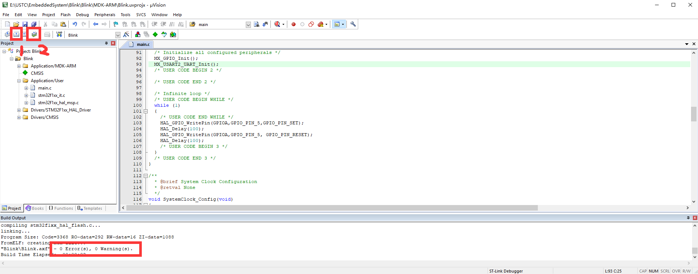

<style>
    img::after {content: attr(alt);}
</style>

# STM32学习笔记
所用板型：NUCLEO-F103RB

MCU：STM32F103RB


<!-- @import "[TOC]" {cmd="toc" depthFrom=1 depthTo=6 orderedList=false} -->

<!-- code_chunk_output -->

- [STM32学习笔记](#stm32学习笔记)
  - [背景知识](#背景知识)
    - [名词解释](#名词解释)
      - [Keil、μVision、MDK、Keil C51](#keil-μvision-mdk-keil-c51)
      - [J-Link、ST-Link、ULink、JTAG、SWD、SWIM](#j-link-st-link-ulink-jtag-swd-swim)
    - [开发方式](#开发方式)
      - [通过IDE开发](#通过ide开发)
      - [手动make开发（适合高级使用者）](#手动make开发适合高级使用者)
    - [基于寄存器开发与基于库开发](#基于寄存器开发与基于库开发)
      - [基于寄存器开发](#基于寄存器开发)
      - [基于库开发](#基于库开发)
  - [Step-by-step Guidance](#step-by-step-guidance)
    - [配置开发环境](#配置开发环境)
    - [实现一个"`Blink`"](#实现一个blink)
      - [一. 使用STM32CubeMX生成基础配置代码](#一-使用stm32cubemx生成基础配置代码)
      - [二. 使用Keil编写程序](#二-使用keil编写程序)
      - [3. 编译、下载](#3-编译-下载)
      - [4. Debug](#4-debug)
    - [中断](#中断)
  - [Arduino-STM32](#arduino-stm32)
  - [Reference](#reference)

<!-- /code_chunk_output -->

  
## 背景知识
这里是一些有的没的背景知识，归纳在这一部分。如果你很急，可以直接跳到[step-by-step-guidance](#step-by-step-guidance)。
### 名词解释
#### Keil、μVision、MDK、Keil C51
- **Keil**是公司的名称，**有时候也指Keil公司的所有软件开发工具**，目前2005年Keil由ARM公司收购，成为ARM的公司之一。

- **μVision**是Keil公司开发的一个集成开发环境（IDE），和Eclipse类似。它包括工程管理，源代码编辑，编译设置，下载调试和模拟仿真等功能，μVision有μVision2、μVision3、μVision4、μVision5四个版本，目前最新的版本是μVision5。它提供一个环境，让开发者易于操作，并不提供能具体的编译和下载功能，需要软件开发者添加。μVision通用于Keil的开发工具中，例如MDK，PK51，PK166，DK251等。

  > 因此，你寻找Keil IDE的入口是`UV4/UV4.exe`。

- **MDK（Microcontroller Development Kit）**，也称**MDK-ARM**、**Keil MDK**、**RealView MDK**、**Keil For ARM**，都是同一个东西。ARM公司现在统一使用MDK-ARM的称呼，MDK的设备数据库中有很多厂商的芯片，是专为微控制器开发的工具，为满足基于MCU进行嵌入式软件开发的工程师需求而设计，支持ARM7，ARM9，Cortex-M4/M3/M1，Cortex-R0/R3/R4等ARM微控制器内核

> 
> 从上图可以看出，MDK Core 又分成四个部分：μVision IDE with Editor（编辑器），ARM
C/C++ Compiler（编译器），Pack Installer（包安装器），μVision Debugger with Trace（调试跟踪
器）。

#### J-Link、ST-Link、ULink、JTAG、SWD、SWIM
- **J-Link**是德国SEGGER公司为支持仿真ARM内核芯片推出的JTAG仿真器，很多ARM芯片的接口协议是JTAG，JLink一端接电脑USB接口，一端接CPU的JTAG接口，JLink充当的作用就是USB转JTAG，支持JTAG和SWD两种模式。

    - 可配合IAR EWAR，ADS，KEIL，WINARM，RealView等集成开发环境；
    - 支持ARM7/ARM9/ARM11，Cortex M0/M1/M3/M4，Cortex A5/A8/A9等内核芯片的仿真；

    

- **ST-Link**是ST意法半导体为评估、开发STM8/STM32系列MCU而设计的集在线仿真与下载为一体的开发工具，支持JTAG/SWD/SWIM三种模式。

    - 支持所有带SWIM接口的STM8系列单片机
    - 支持所有带JTAG/SWD接口的STM32系列单片机

    

- **JTAG**（Joint Test Action Group，联合测试行动小组）是一种国际标准测试协议（IEEE 1149.1兼容），主要用于芯片内部测试，现在多数的器件都支持JTAG协议，ARM、DSP、FPGA等，JTAG接口的单片机用电脑USB下载调试程序，需要用到J-Link（USB转JTAG）。

    JTAG有10pin的、14pin的和20pin的，尽管引脚数和引脚的排列顺序不同，但是其中有一些引脚是一样的
    TDI，TMS，TCK，TDO，分别对应数据输入，模式选择，时钟，数据输出，复位管脚可不接。

    占用5个IO口。

- **SWD**全称是Serial Wire Debug（串行调试），SWD模式下用JLink给我们的板子debug时，是用标准的二线DIO和CLK，**RESET管脚可不接，当你频繁下载失败时，可接上RESET管脚再试**。

    占用2个IO口。

- **SWIM**接口常见于ST的STM8系列单片机，ST-Link2与STM8连接只需要4根线，见表格。


### 开发方式
#### 通过IDE开发
通常来说，STM32使用IDE进行开发的较多，使用IDE也较容易上手。

STM32支持若干种不同的IDE进行开发，[官方文档](https://www.stmcu.com.cn/Designresource/design_resource_detail?file_name=UM1727_STM32%E7%9A%84Nucleo%E6%9D%BF%E8%BD%AF%E4%BB%B6%E5%BC%80%E5%8F%91%E5%B7%A5%E5%85%B7%E5%85%A5%E9%97%A8%E6%8C%87%E5%8D%97&lang=EN&ver=5&cat=user_manual)给出的支持有：
> - **EWARM v7.10.3 or later(a)**
> 
>   30-day evaluation edition
> 
>   32-Kbyte Limited QuickStart edition (16-Kbyte limitation for Cortex M0)
> - **MDK-ARM v5.17 or later(a)(b)**
> 
>   MDK-Lite (32-Kbyte code size limitation)
> 
> - **TrueSTUDIO Lite v5 or later(b)**
> 
>   No limitation
> 
> - **SW4STM32 v1.5 and later(a)**
> 
>   No limitation
> 
EWARM指的是通常意义上的IAR，IAR Embedded Workbench for ARM。

其中MDK-ARM指的是通常意义上的Keil，即Keil MDK-ARM。

本文使用==MDK527==。


#### 手动make开发（适合高级使用者）
笔者目前也不会，先提供一个[链接](http://www.stmcu.org.cn/module/forum/thread-603753-1-1.html)以供参考。

### 基于寄存器开发与基于库开发
#### 基于寄存器开发
在传统C51中通常对寄存器进行直接操作来实现功能，如设置端口电平为：

对STM32来说，当然也可以这么做。但是STM32的上百个寄存器，相比于51的二十几个，要一个个记住、单独操作不大现实，过于麻烦。所以通常来说，STM32的开发都是使用HAL库进行开发的。
#### 基于库开发
1. 传统的Keil ARM开发模式
  标准库
2. 通过STM的HAL以及CubeMx配置的模式

## Step-by-step Guidance
在这篇笔记中，使用的是CubeMx + Keil MDK-ARM，使用HAL库进行开发的开发方式。
### 配置开发环境
1. [MDK5（Keil µvision5）](https://www.Keil.com/download/product/)，官方网站下载，本文使用的版本是==MDK527==。（当然可能还要破解一下）（当然也可以去各种X盘下载）

2. [ST-Link驱动](https://www.stmcu.com.cn/Designresource/design_resource_detail/file/315621/lang/EN/token/959ecda9e5c252b9b101db286ab1736f)，在ST官网下载。

    > All the STM32 Nucleo boards include an ST-LINK/V2-1 embedded debug tool interface.This interface needs a dedicated USB driver to be installed. 

3. MDK5相关于这几个处理器的固件包（Firmware Package），Keil官网下载/或者在Keil中使用*Pack Installer*。
   
4. [STM32CubeMx](https://www.st.com/zh/development-tools/stm32cubemx.html)，官方网站下载。

### 实现一个"`Blink`"
`Blink`相当于单片机编程中的`Helloworld`，它的目标就是让一个LED（通常是板载的LED）Blink一下。
下面展示使用CubeMX搭建工程，并在Keil中编译下载的方法：

#### 一. 使用STM32CubeMX生成基础配置代码
1. 打开CubeMx，在New Project区进入板型选择器。


2. 搜索相应的板子型号，双击搜索结果。


3. 默认，选Yes。


4. 点击每个引脚可以直接配置其输出方式。在这里由于我们没有需求，所以不用改动。


5. 进入Project Manager。


6. 设置工程的名字和路径。别忘了将IDE选择为==MDK-ARM V5==。


7. 点击GENERATE CODE，生成工程！


8. 这个时候工程已经生成好了，接下来点击Open Project，将工作转移到Keil。


#### 二. 使用Keil编写程序
1. 打开Keil主界面，这时候CubeMX已经帮我们配置好了一堆库文件，我们不用管他们。接下来我们只需做自己的事就行了。比如找到`main.c`：


2. 可以看到`main.c`里这时候已经被CubeMx生成了一堆初始化代码，同样不用管：


找到`main()`函数：


3. 在`main()`函数里一堆初始化函数后的循环里加入`Blink`的功能代码：
```C
HAL_GPIO_WritePin(GPIOA,GPIO_PIN_5,GPIO_PIN_SET);
HAL_Delay(100);
HAL_GPIO_WritePin(GPIOA,GPIO_PIN_5, GPIO_PIN_RESET);
HAL_Delay(100);
```
这段代码对板载LED所在IO口每隔100毫秒进行写一次高/低电平，这里调用的全部都是HAL库的函数。

#### 3. 编译、下载
先执行Build将代码编译，如果代码有Error或者Warning，会在下方的Build Output窗口产生报错信息。如果没有问题，那么将板子通过USB连接到电脑，可以进行Download了。这一步将代码烧到STM32板子的flash内。


提示烧写完毕：


这个时候再按一下板子的Reset按钮，就可以看到板载的LED闪起来了。

#### 4. Debug
当然也可以进行（也是非常必要）的一步是debug。选择Debug菜单-Start/Stop Debug Session进入debug模式：


在这里可以像debug本机程序一样设置断点，单步执行等。在右下角Call Stack里可以监视程序的变量。

### 中断


## Arduino-STM32
目前还没试验成功。

1. 安装Arduino IDE[^]
2. 工具-开发板管理器-安装Arduino SAM boards (Cortex-M3)
   > You must do this step, it installs the arm-none-eabi-g++ toolchain）


测试[^1]

## Reference
1. [菜鸟两天入门STM32开发](https://www.jianshu.com/p/e1b6503f638b)
2. [STM32的Nucleo版用户手册](https://www.stmcu.com.cn/Designresource/design_resource_detail?file_name=UM1724_STM32%E7%9A%8464%E5%BC%95%E8%84%9ANucleo%E6%9D%BF%E7%94%A8%E6%88%B7%E6%89%8B%E5%86%8C&lang=EN&ver=9&cat=user_manual)
3. [教麦叔了解J-Link、ST-Link、ULink、JTAG、SWD、SWIM的区别](https://www.cnblogs.com/Albert992/p/12783198.html)
