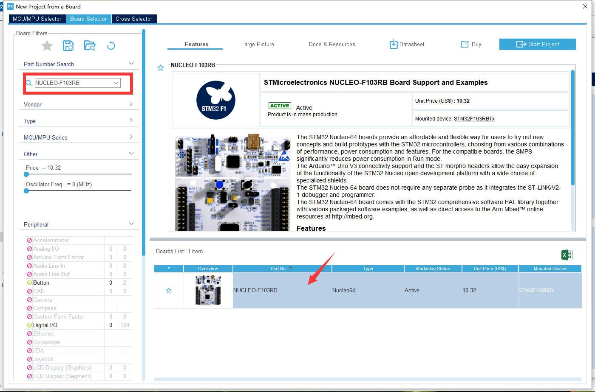

<style>
    img::after {content: attr(alt);}
</style>

# STM32学习笔记
所用板型：NUCLEO-F103RB

MCU：STM32F103RB

- [STM32学习笔记](#stm32学习笔记)
  - [背景知识](#背景知识)
    - [开发方式选择](#开发方式选择)
      - [通过IDE开发与手写make开发](#通过ide开发与手写make开发)
        - [通过IDE开发](#通过ide开发)
        - [手动make开发（适合高级使用者）](#手动make开发适合高级使用者)
      - [寄存器开发与HAL开发](#寄存器开发与hal开发)
        - [寄存器开发](#寄存器开发)
        - [HAL开发](#hal开发)
    - [相关文档](#相关文档)
  - [Step-by-step Guidance](#step-by-step-guidance)
    - [配置开发环境](#配置开发环境)
    - [实现一个"Blink"](#实现一个blink)
      - [1. 使用STM32CubeMX生成基础配置代码](#1-使用stm32cubemx生成基础配置代码)
      - [2. 使用Keil编写程序](#2-使用keil编写程序)
      - [Debug](#debug)
    - [中断](#中断)
  - [Arduino-STM32](#arduino-stm32)
  - [通过MbedOS网站提供的方式](#通过mbedos网站提供的方式)
  - [reference](#reference)
  
## 背景知识
这里是一些有的没的背景知识，作为补充归纳在这一部分。如果你很急，可以直接跳到[step-by-step-guidance](#step-by-step-guidance)。
### 开发方式
#### 通过IDE开发与手写make开发
##### 通过IDE开发
STM32支持若干种不同的IDE进行开发，官方文档给出的支持有：
> - EWARM v7.10.3 or later(a)
> 
>   30-day evaluation edition
> 
>   32-Kbyte Limited QuickStart edition (16-Kbyte limitation for Cortex M0)
> - MDK-ARM v5.17 or later(a)(b)
> 
>   MDK-Lite (32-Kbyte code size limitation)
> 
> - TrueSTUDIO Lite v5 or later(b)
> 
>   No limitation
> 
> - SW4STM32 v1.5 and later(a)
> 
>   No limitation
> 
 IAR Embedded Workbench for ARM (EWARM)

Keil MDK-ARM Microcontroller Development Kit

本文使用**Keil µvision5**（即MDK-ARM v5.xx），以==MDK527==为例。
##### 手动make开发（适合高级使用者）
笔者目前也不会，先提供一个[链接](http://www.stmcu.org.cn/module/forum/thread-603753-1-1.html)以供参考。

#### 寄存器开发与HAL开发
##### 寄存器开发
在传统C51中通常对寄存器进行直接操作来实现功能，如设置端口电平为：

对STM32来说，当然也可以这么做。但是STM32的上百个寄存器，相比于51的二十一个，要一个个记住、单独操作不大现实，过于麻烦。所以通常来说，STM32的开发都是使用HAL库进行开发的。
##### HAL开发
1. 传统的Keil ARM开发模式

2. 通过STM的HAL以及CubeMx配置的模式
   


### 相关文档
[STM32的Nucleo版用户手册](https://www.stmcu.com.cn/Designresource/design_resource_detail?file_name=UM1724_STM32%E7%9A%8464%E5%BC%95%E8%84%9ANucleo%E6%9D%BF%E7%94%A8%E6%88%B7%E6%89%8B%E5%86%8C&lang=EN&ver=9&cat=user_manual)

## Step-by-step Guidance

### 配置开发环境
1. [Keil µvision5](https://www.keil.com/download/product/)，官方网站下载，本文使用的版本是==MDK527==。（当然可能还要破解一下）（当然也可以去各种X盘下载）

2. [ST-Link驱动](https://www.stmcu.com.cn/Designresource/design_resource_detail/file/315621/lang/EN/token/959ecda9e5c252b9b101db286ab1736f)，在ST官网下载。

    > All the STM32 Nucleo boards include an ST-LINK/V2-1 embedded debug tool interface.This interface needs a dedicated USB driver to be installed. 

3. Keil5相关于这几个处理器的固件包（Firmware Package），Keil官网下载/或者在Keil中使用*Pack Installer*。
   
4. [STM32ubeMx](https://www.st.com/zh/development-tools/stm32cubemx.html)，官方网站下载。

### 实现一个"Blink"
Blink相当于单片机编程中的helloworld，它的目标就是让一个LED（通常是板载的LED）Blink一下。
下面展示使用CubeMX搭建工程并在Keil中编译下载的方法：

#### 1. 使用STM32CubeMX生成基础配置代码
##### CubeMx主界面


##### CubeMx版型选择器


#### 2. 使用Keil编写程序
```C
HAL_GPIO_WritePin(GPIOA,GPIO_PIN_5,GPIO_PIN_SET);
HAL_Delay(100);
HAL_GPIO_WritePin(GPIOA,GPIO_PIN_5, GPIO_PIN_RESET);
HAL_Delay(100);
```
#### 3. 编译、下载
#### 4. Debug

### 中断

## Arduino-STM32
1. 安装Arduino IDE
2. 工具-开发板管理器-安装Arduino SAM boards (Cortex-M3)
   > You must do this step, it installs the arm-none-eabi-g++ toolchain）


## 通过MbedOS网站提供的方式
## reference
1. [https://www.jianshu.com/p/e1b6503f638b](https://www.jianshu.com/p/e1b6503f638b)