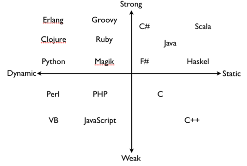

# Python入坑指北

> Beautiful is better than ugly.
> Explicit is better than implicit.
> Simple is better than complex.
> Complex is better than complicated.
> Flat is better than nested.
> Sparse is better than dense.
> Readability counts.
> Special cases aren't special enough to break the rules.
> Although practicality beats purity.
> Errors should never pass silently.
> Unless explicitly silenced.
> In the face of ambiguity, refuse the temptation to guess.
> There should be one-- and preferably only one --obvious way to do it.
> Although that way may not be obvious at first unless you're Dutch.
> Now is better than never.
> Although never is often better than *right* now.
> If the implementation is hard to explain, it's a bad idea.
> If the implementation is easy to explain, it may be a good idea.
> Namespaces are one honking great idea -- let's do more of those!
>
> *The Zen of Python*, by Tim Peters

[TOC]

## Motivation
比“怎么做”更重要的是“为什么这么做”，比“写完一串程序执行序列”更重要的是“对问题建立一个正确地抽象”。

假设读者对`C`有一定了解。

## 准备工作

### 安装环境

`PATH`

### `python` 与 `pip`

## Helloworld

### 脚本式
创建一个后缀名为`.py`的文本文件`helloworld.py`，在其中写入:

```py
print("hello, world!")
```

在终端执行（如果你没有使用IDE的话）：

```bash
python helloworld.py
```

执行结果为：

```
hello, world!
```

> 就是这么简单！

### 交互式  

`python`提供了一个交互式shell，所谓交互式，即“用户输入一行，解释器返回一行结果”的运行模式，对于简单的验证想法来说很方便。

在终端中输入`python`打开交互式shell，并执行语句：

```bash
[root@VM-16-15-centos ~]# python
Python 3.6.8 (default, May 21 2019, 23:51:36)
[GCC 8.2.1 20180905 (Red Hat 8.2.1-3)] on linux
Type "help", "copyright", "credits" or "license" for more information.
>>> print("hello, world!")
hello, world!
```

在后文中，为了表述方便，两种模式会混合使用。

## 变量与类型

### 使用变量

在`python`中创建一个变量或给变量赋值非常简单：

```py
x = 1
x = "helloworld"
```

可以看到既不需要先声明变量，也不需要定义变量的类型，这体现了`python`作为一种**动态类型**语言的特性。所谓“动态类型”，即“类型检查”是在运行时完成的，并且变量的类型是可以在运行中改变的。

初从`C`转来的同学可能会担心：“这不会把变量类型搞乱了吗？”但在这个问题上其实大可放心，“动态类型”不意味着不关心类型，在运行中的每一步，一个变量的类型都是可以确定的：

```py
x = 1
print(type(x))
x = "1"
print(type(x))
```

运行结果：

```
<class 'int'>
<class 'str'>
```

可以看到变量`x`始终具有确定的类型，只不过是从`int`变为了`str`。这使得函数传参时类型可确保，但是需要程序员来进行控制。


事实上，`python`是一种**强类型**语言。所谓“强类型”，即严格的类型检查，比如拒绝*隐式类型转换*。在`python`中：

```py
x = 1
y = "1"
print(x + y)
```

运行结果为：

```bash
Traceback (most recent call last):
  File "<stdin>", line 1, in <module>
TypeError: unsupported operand type(s) for +: 'int' and 'str'
```

可以看到由于`int`和`str`之间不支持“相加”的操作，执行被中断并抛出了一个`TypeError`。

> 注意这里表达的微妙区别，是由于`int`与`str`之间没有“相加”操作才异常，而不是因为`int`与`str`类型不同而异常。见[鸭子类型](#鸭子类型)。

相反，在作为一种**弱类型**语言的`C`中：

```c
#include <stdio.h>

int main()
{
    int x = 1;
    char y = '1';
    printf("%d\n", x + y);
   
    return 0;
}
```

运行结果：
```
50
```

由于*隐式类型转换*，`'1'`变为了其ascii码`49`，相加得到结果`50`。

> 在`C`中，“变量”的概念更等价于其实际机器中的值，而不是严格的类型控制。这种更加贴近硬件的特性是有优有劣的。



动态类型给予了我们更强的表达能力。

### 鸭子类型
鸭子类型（duck-typing）指一种编程风格，它并不限制对象类型，而是要求对象具有对应的方法。

> 如果一个东西看起来像鸭子，叫起来也像鸭子，那么肯定就是鸭子。

整数之间能够“相加”，是因为`int`具有`__add__`方法，它返回两个`int`对象的数学和：

```py
>>> 1 + 2
3
```

字符串直接能够“相加”，是因为`str`也具有`__add__`方法，它返回两个`str`对象的拼接：

```py
>>> 'a' + 'bc'
'abc'
```

`python`的许多函数被设计为接受鸭子类型的参数，比如`print()`， 基本上任意对象均可以不预加转换地直接传入`print()`进行打印：

```py
def foo():
    return 0

class Foo:
    pass

print(1, "f", foo, foo(), Foo, Foo())
```

执行结果为：

```bash
1 f <function foo at 0x00000144D2DAF040> 0 <class '__main__.Foo'> <__main__.Foo object at 0x00000144D3250A60>
```

实际上，`print()`接受任意具有`__str__`或者`__repr__`方法的对象，当一个对象被传入，`print()`调用`str()`将其转化为对应的内容并输出。上文打印了了多种类型的对象，分别为：整数、字符串、函数、函数的返回值、类、类的实例。

> `__str__`与`__repr__`目的略有区别，但大致都是为了将对象转化为字符串形式。

再一个例子比如用于打开文件的函数`open()`，其接受的参数`file`不需要规定明确的类型，只需要是`path-like object`。这意味着无论是直接传入一个表示路径的`str`或者`bytes`，还是传入一个具有`__fspath__`方法的对象，都可以被接受并正常工作。

`xxx-like object`是一个常见的`python`函数参数要求，他要求了对象的方法，而不是对象的类型。

### Type Hints

上文说到`python`并不会限制传入函数的参数类型和函数的返回类型，那么控制类型是否就完全没有必要了呢？也不尽然。

在代码规模不大的时候，我们希望写起来简单又能很快实现功能，完全依赖程序员的大脑确保类型无误，这是问题不大的。但是随着代码规模的扩大，确保参数类型成了比较难做（到没有BUG）的一件事，并且如果项目版本迭代需要代码重构的话，动态类型又会使得重构成为一个费尽心力的工作，因此`PEP 484 -- Type Hints`被提出了。

Type Hints是对函数或者变量的类型注解，在`python 3.5`被正式引入，它大致写起来是这样的：

```py
def add(x: int, y: int) -> int:
    return x + y

a: int = 100
b: int = 200

print(add(a, b))
```

可以看到带Type Hints的写法与之前相比只不过是在变量名或者参数名后增加了`:`，以及函数返回值增加了`->`，后面带上类型。Type Hints的使用也相当自由，不强制要求一定要有。如果没有的话，对应的参数类型要求会是`Any`。

> `Any`, `List`, `Tuple`, `Callable`等详细类型注解的写法参考库`typing`。

需要注意的是，正如其名，**Type Hints只是程序员对自己的约束（暗示）**，并不会真正在运行时检查类型。需要判断`arg`的类型可以使用

```py
if type(arg) is xxx:
    # do something
```

或者

```py
if isinstance(arg, xxx):
    # do something
```

> 后者与前者的区别是`isinstance()`会考虑继承关系，即子类的实例也是父类的实例。

那么有人又会有疑问，绕了这么大一圈，Type Hints又不在运行时检查，岂不是一点用都没有？并非。Type Hints的正确用法是在编写代码时IDE可以进行类型推断，如果编写代码时出现了类型错误会回报`error`或者`warning`，在这个意义上，程序员只需要根据报错信息检查代码，即可确保类型无误，**同时这么做也不会丧失动态语言的灵活性**。

> `Pycharm`甚至可以提供一些更酷的类型推断，比如上文中的函数如果不写Type Hints的话：
> ```py
> def add(x, y):
>     return x + y
> ```
> `Pycharm`会告诉你`x`的类型是`x: {__add__}`，即支持`__add__`方法。

### 可变对象与不可变对象

可变对象与不可变对象的区别是我们不得不讨论的一件麻烦事。

## 函数与类

`python`是一种**多范式**的语言，对于过程式、函数式以及面向对象的写法均提供了支持。我们将[编程范式](#编程范式)的问题往后放一放，先从简单的点切入。

`python`通过`def`关键字来定义函数：

```py
def foo(arg1, arg2):
    # do something
```

`python`的函数可以返回多个值：

```py
>>> def origin():
...     return 0, 0
...
>>> x, y = origin()
>>> print(x, y)
0 0
```

> 函数的位置参数、可变参数、关键字参数详细内容见[函数的参数](#函数的参数)。

通过`class`关键字来定义类：

```py
class Foo(object):
    # do something
```

不区分变量、函数、类、类的实例，它们均为**对象**。


函数式编程指南

### 函数的参数

### 编程范式

## 迭代器

无限大的流

## 导入模块

## 异常

EAFP