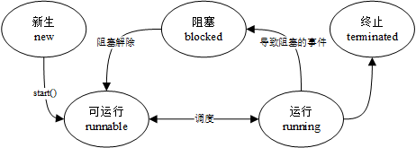
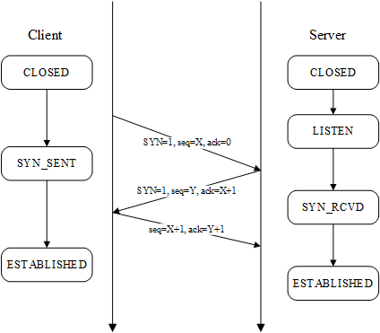
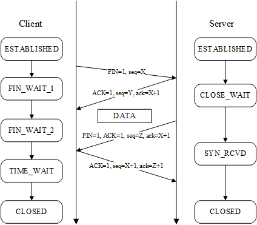

# 面经八股

[TOC]

## 计算机技术

### 操作系统

#### 线程的状态模型

#### 线程与进程

- 线程：任务调度的最小单位
- 进程：资源调度的最小单位

#### 死锁

##### 四个必要条件

- 互斥条件(Mutual exclusion)：资源不能被共享，只能由一个进程使用。

- 请求与保持条件(Hold and wait)：已经得到资源的进程可以再次申请新的资源。

- 非剥夺条件(No pre-emption)：已经分配的资源不能从相应的进程中被强制地剥夺。

- 循环等待条件(Circular wait)：系统中若干进程组成环路，该环路中每个进程都在等待相邻进程正占用的资源。

##### 解决死锁

#### 通信

##### 线程间通信

- global variables
- message queue
- event

##### 进程间通信

- pipe
- message queue
- signal
- shared memory
- socket

#### 进程同步

- 临界区（Critical Section）:通过对多线程的串行化来访问公共资源或一段代码，速度快，适合控制数据访问

- 互斥量（Mutex）:为协调共同对一个共享资源的单独访问而设计的

- 信号量（Semaphore）:为控制一个具有有限数量用户资源而设计。它允许多个线程在同一时刻访问同一资源，但是需要限制在同一时刻访问此资源的最大线程数目。互斥量是信号量的一种特殊情况，当信号量的最大资源数=1就是互斥量了

- 事件（Event）: 用来通知线程有一些事件已发生，从而启动后继任务的开始

### 计算机网络

#### TCP

##### 三次握手

建立端对端**可靠**通信所需的最低通信次数是三次。双方均需要确知对方能够正确接收自身发送的数据，需要：

1. A向B发送数据
2. B回复ACK
3. B向A发送数据
4. A回复ACK

其中2、3步可以合成一步，因此最少需要三次。

##### 四次挥手

客户端主动发送FIN关闭连接，停止发送报文，服务器端需要发送完剩余的报文。

#### HTTP

##### 方法

- GET：请求获取Request——URL所标识的资源

- POST：在Request——URL所标识的资源后附加资源

- HEAD：请求获取由Request——URL所标识的资源的响应消息报头

- PUT：请求服务器存储一个资源，由Request——URL作为其标识

- DELETE：请求服务器删除由Request——URL所标识的资源

- TRACE：请求服务器回送收到的请求信息（用于测试和诊断）

- CONNECT：保留

- OPTIONS：请求查询服务器性能

##### GET和POST的区别

### 数据库

#### ACID

- 原子性（Atomicity）：事务作为一个整体被执行，包含在其中的对数据库的操作要么全部被执行，要么都不执行。

- 一致性（Consistency）：事务应确保数据库的状态从一个一致状态转变为另一个一致状态。一致状态的含义是数据库中的数据应满足完整性约束。

- 隔离性（Isolation）：多个事务并发执行时，一个事务的执行不应影响其他事务的执行。

- 持久性（Durability）：已被提交的事务对数据库的修改应该永久保存在数据库中。