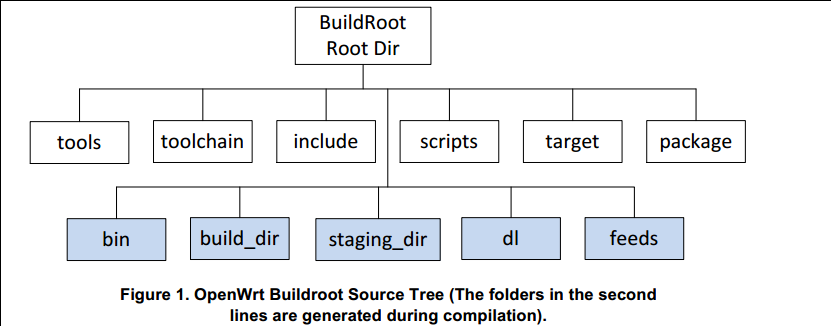

# OpenWrt入门

记录了OpenWrt的入门步骤和踩的一些坑。

[TOC]

## Helloworld[^helloworld]

### 构建编译环境

[^helloworld]: https://openwrt.org/zh/docs/guide-developer/quickstart-build-images

操作系统：Ubuntu 20.04 LTS
开发板：JS9331开发板

可以先更换国内源。

安装依赖：

```
sudo apt-get install subversion g++ zlib1g-dev build-essential git python rsync man-db
sudo apt-get install libncurses5-dev gawk gettext unzip file libssl-dev wget zip time
```

### 获取OpenWrt的源代码

```bash
git clone https://git.openwrt.org/openwrt/openwrt.git/
cd openwrt
```

 - 如果无法从地址`git clone`，可以访问镜像：

```bash
git clone https://github.com/openwrt/openwrt.git
```

切换到指定的版本，首先查看可用的版本号：

```bash
git tag
```

切换到`v17.01.7`

```bash
git checkout v17.01.7
```

### 更新和安装`feeds`

切换到`./scripts`文件夹下：

```
cd scripts
./feeds update -a
./feeds install -a
```

> `feeds install`使得下载的包在`make menuconfig`中可用。

- 在`./feeds update -a`时遇到端口443拒接访问：

```bash
fatal: 无法访问 'https://git.lede-project.org/feed/packages.git/'：
Failed to connect to git.lede-project.org port 443: 拒绝连接
```

可以在根目录的`feeds.conf.default`中把所有的`https://`改为`git://`。

### 设置编译选项

```bash
make menuconfig
```

#### 安装LuCI
如果上一步`./feeds install -a`正确，那`menuconfig`里应该会多出`LuCI`的选项。

在`LuCI -> 1. Collections`里勾选：

- luci
- luci-ssl-openssl

要添加中文支持，在`LuCI -> 2. Modules -> Translation`里勾选：

- Chinese

> 发现这么设置后无论是否勾选`3. Applications -> luci-app-uhttpd`最终生成的固件中都会包含`httpd`

### 编译

```bash
make
```

如果报错了，使用

```bash
make -j1 V=s
```

查看具体报错信息。

生成的`.bin`文件位于`.bin/targets/`中，对应`menuconfig`里面选择的target。

如果出现了各种：

```bash
check_data_file_clashes: Package libustream-openssl20150806 wants to install file /home/b/Desktop/test_openwrt/openwrt/build_dir/target-i386_pentium4_musl/root-x86/lib/libustream-ssl.so
But that file is already provided by package * libustream-mbedtls20150806
```

可以检查`menuconfig`的选项，往往是配置有问题，实在不行只能删掉配置、清空文件然后重新编译。由于第一次编译时间实在是太长了，我们不喜欢这么干。

```
mv .config .config.bak
make clean
```

### 烧写
#### 使用u-boot + TFTP烧写


### 已知问题

`OpenWrt 19.07.7`编译会报警告

```bash
WARNING: Makefile 'package/feeds/packages/ksmbd/Makefile' has a dependency on 'kmod-crypto-arc4', which does not exist
```

但是实际不影响编译和使用，原因未知。


## OpenWrt目录结构


如图，第一行是原始目录（由`Git`管理的 + 下载的），第二行是编译生成的目录，作用分别是：

目录名 | 作用
:-: | :-:
tools | 编译时需要一些工具， tools里包含了获取和编译这些工具的命令。里面是一些Makefile，有的可能还有patch。每个Makefile里都有一句 `$(eval $(call HostBuild))`，表示编译这个工具是为了在主机上使用的。
toolchain | 包含一些命令去获取kernel headers, C library, bin-utils, compiler, debugger
target | 各平台在这个目录里定义了firmware和kernel的编译过程。
package | 包含针对各个软件包的Makefile。openwrt定义了一套Makefile模板，各软件参照这个模板定义了自己的信息，如软件包的版本、下载地址、编译方式、安装地址等。
include | openwrt的Makefile都存放在这里。
scripts | 一些perl脚本，用于软件包管理。
dl | 软件包下载后都放到这个目录里
build_dir | 软件包都解压到build_dir/里，然后在此编译
staging_dir | 最终安装目录。tools, toolchain被安装到这里，rootfs也会放到这里。
feeds |
bin | 编译完成之后，firmware和各ipk会放到此目录下。


# LuCI

Lua Configuration Interface

## 结构

### 仓库目录结构

目录名 | 作用
:-: | :-:
applications | 针对其他模块或者应用的单独的一个应用或者插件，可理解为功能模块
i18n | 国际化
modules | 应用集 ？包含主要的用户文件、核心文件
theme | 主题
build | 编译过程的脚本
host | 编译产生的：将语言打包为二进制格式
contrib | /
ipkg-ramips_24kec | 编译产生的：封装make menuconfig阶段选中的页面和功能
libs | 独立的库函数：控件、接口、cbi.js、
po | 语言文件

`modules`下的`luci-base`和`luci-mod-admin-full`包含了网页的基本功能。

### module目录结构

文件/目录名 | 子目录名 | 作用
:-: | :-: | :-:
htdocs | / | html+docs，此目录存放HTML相关文件，主要包含以下两个目录，当烧录到硬件设备后，将拷贝到/www根目录下
/ | cgi-bin | 存放luci启动脚本
/ | luci-static | 存放HTML相关文件，包含CSS、JS及网页图片等文件
luasrc | / | lua+src，此目录存放系统功能的LUA文件及M（model）、V（view）、C（controller）文件夹，当烧录到硬件设备后，将拷贝到/usr/lib/lua/luci目录下
/ | controller | 控制器，生成页面的菜单栏并定义各个页面的调用方法
/ | model | 数据模型，根据底层UCI配置文件生成页面
/ | view | 视图，HTML页面
po | / | 定义页面的语言风格
root | / | 存放配置文件，该目录下的所有文件将拷贝到硬件设备根目录下
src | / | 生成所需要的库文件及LUA脚本
Makefile | / | 定义模块的编译方法

### 板上目录结构

1. `/www`下

文件/目录名 | 作用
:-: | :-:
cgi-bin | 此文件从luci-base下拷贝过来的，存放luci启动脚本
index.html | http请求的主页面，默认是/www/index.html，这个文件里显示了登录时常看见的那句话“LuCI - Lua Configuration Interface”，同时也指定了href链接/cgi-bin/luci
luci-static | 存放HTML相关文件，包含CSS、JS及网页图片等文件。不同主题的htdocs/luci-static都将拷贝到这个目录下

2. `/usr/lib/lua`下

顾名思义，存放了与LUA相关的文件，在LUA脚本中，通过require命令引用的脚本及函数，起始路径都是该目录。同时，不同模型及主题的luasrc文件夹都拷贝到/usr/lib/lua/luci目录下，通过/etc/config/luci中的mediaurlbase字段决定当前使用的主题及语言。

## 配置开发环境

根据官方文档[^modules_how_to]，LuCI的开发方式主要有两种:

[^modules_how_to]: https://github.com/openwrt/luci/wiki/ModulesHowTo

1. 部署环境开发
2. 开发环境开发

前者即直接在烧写好了OpenWrt的板上进行代码编写，写完刷新一下即可在网页看到效果。

> 凡是修改`controller/`文件夹中的配置，都需要重启板子或把`/tmp/`目录下`luci-indexcache`、`luci-modulecache/luci-sessions/`删除才能生效，其他几个文件夹修改可不用，刷新一下网页即可。

后者是在LuCI的git仓库中进行代码编写，写完需要编译固件并烧写到板上才能看到效果。

> 也就是说，LuCI的开发缺少一个“脚手架”？

两种开发方法大同小异，各有优劣。


# 搭建VMware运行的x86 OpenWrt

### 编译固件

执行

```bash
make menuconfig
```

`Target System`选择`x86`，`Subtarget`选择`x86_64`，`Target Profile`默认为`Generic`。

在`Target Images`中勾选`Build Vmware image files (VMDK)`，这样会生成`.vmdk`格式的镜像，可以直接供VMware使用。

在`LuCI -> 1. Collections`里勾选`luci`和`luci-ssl-openssl`，之后

```bash
make
```

之后生成的固件在`./bin/targets/x86/64`下，文件名如`openwrt-x86-64-combined-ext4.vmdk`。


### 设置虚拟机

本文使用的VMware版本为`VMware Workstation Pro 15`，下面记录在虚拟机中安装上文编译的OpenWrt镜像的步骤。

1. 打开`文件 -> 新建虚拟机`

2. 选择`自定义（高级）`

3. 硬件兼容性可以保留默认`Workstation 15.x`

4. 选择`稍后安装操作系统`

5. 客户机操作系统：

    选择`Linux`；由于我编译的`OpenWrt`中内核源码版本为`4.14`，故版本选择`其他Linux 4.x 64位`

6. 设置名称和路径、处理器数量、内存大小等，合适即可

7. 网络连接、I/O控制器类型、虚拟磁盘类型可以选择默认值

8. 磁盘选择`使用现有虚拟磁盘`，选择上一步编译生成的`.vmdk`文件

    如果弹出`将现有虚拟磁盘转换为更新的格式？`，可以选择`转换`

9. **配置网卡**，选择`自定义硬件`：

    OpenWrt需要一个WAN口和一个LAN口，所以至少需要两个`网络适配器`，其中用于WAN口的选择`桥接模式`，用于LAN口的可以选择`自定义`中任意一个未被使用的虚拟网络。我使用的配置是：

    设备 | 摘要
    :-: | :-:
    网络适配器 | 自定义（VMnet2）
    网络适配器2 | 桥接模式（自动）

10. 至此虚拟机建立完成，启动虚拟机

11. **设置网络参数**：

    进入OpenWrt系统，敲一下回车进入命令行，然后修改网络配置文件：

    ```bash
    vim /etc/config/network
    ```

    主要是保证`'lan'`和`'wan'`这两个配置没问题，这里需要打开VMWare中`编辑 -> 虚拟网络编辑器`查看VMnet的网段。

    这里我的`VMnet2`的子网地址是`192.168.233.0`，并且我的宿主机为`192.168.233.1`，因此只需要将`'lan'`下的`option ipaddr`修改到同一网段下的另一个IP即可。

    `wan`我这里保持的默认`dhcp`没有出现问题。

    给出一个我的参考：
    ```bash
    config interface 'lan'
        option type 'bridge'
        option ifname 'eth0'
        option proto 'static'
        option ipaddr '192.168.233.10'
        option netmask '255.255.255.0'
        option ip6assign '60'

    config interface 'wan'
        option ifname 'eth1'
        option proto 'dhcp'
    ```

    之后使用

    ```bash
    service network restart
    ```

    如果WAN口配置没有问题，那在OpenWrt虚拟机中应该可以直接ping通外网，如

    ```bash
    ping www.baidu.com
    ```

    如果LAN口没有问题，那宿主机和OpenWrt应该可以互相ping通，比如在宿主机ping虚拟机：

    ```bash
    ping 192.168.233.10
    ```

         