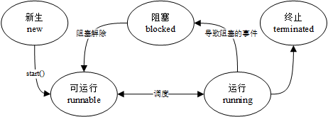
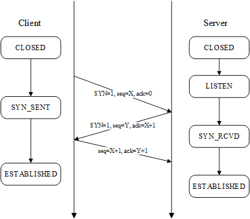
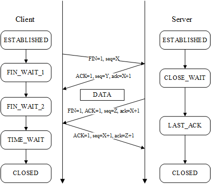

# 面经八股

[TOC]

## 计算机技术

### 操作系统

#### 线程的状态模型

#### 线程与进程

- 线程：任务调度的最小单位
- 进程：资源调度的最小单位

#### 死锁

##### 四个必要条件

- 互斥条件(Mutual exclusion)：资源不能被共享，只能由一个进程使用。

- 请求与保持条件(Hold and wait)：已经得到资源的进程可以再次申请新的资源。

- 非剥夺条件(No pre-emption)：已经分配的资源不能从相应的进程中被强制地剥夺。

- 循环等待条件(Circular wait)：系统中若干进程组成环路，该环路中每个进程都在等待相邻进程正占用的资源。

##### 解决死锁

#### 通信

##### 线程间通信

- global variables
- message queue
- event

##### 进程间通信

- pipe
- message queue
- signal
- shared memory
- socket

#### 进程同步

- 临界区（Critical Section）:通过对多线程的串行化来访问公共资源或一段代码，速度快，适合控制数据访问

- 互斥量（Mutex）:为协调共同对一个共享资源的单独访问而设计的

- 信号量（Semaphore）:为控制一个具有有限数量用户资源而设计。它允许多个线程在同一时刻访问同一资源，但是需要限制在同一时刻访问此资源的最大线程数目。互斥量是信号量的一种特殊情况，当信号量的最大资源数=1就是互斥量了

- 事件（Event）: 用来通知线程有一些事件已发生，从而启动后继任务的开始

### 计算机网络

#### TCP

##### 三次握手

建立端对端**可靠**通信所需的最低通信次数是三次。双方均需要确知对方能够正确接收自身发送的数据，需要：

1. A向B发送数据
2. B回复ACK
3. B向A发送数据
4. A回复ACK

其中2、3步可以合成一步，因此最少需要三次。

##### 四次挥手

客户端主动发送FIN关闭连接，停止发送报文，服务器端需要发送完剩余的报文。

- TIME_WAIT的意义：

    1. 如果client的最后一个ACK丢失，而client又不使用TIME_WAIT保存自己的连接状态，那么当server重传FIN的时候双方会异常响应。

    2. 由于IP是不具备保序性的，所以可能有数据包比server的FIN报文到达的晚，如果不具备TIME_WAIT状态而又重新建立了连接，这个数据包会被认为是新建立的连接传来的。

    3. 通常等待时间是2MSL（Maximum Segment Lifetime），指一个TCP分段能在网络中存在的最大时间。取决于实现，30秒-2分钟。

#### HTTP

##### 方法

- GET：请求获取Request——URL所标识的资源

- POST：在Request——URL所标识的资源后附加资源

- HEAD：请求获取由Request——URL所标识的资源的响应消息报头

- PUT：请求服务器存储一个资源，由Request——URL作为其标识

- DELETE：请求服务器删除由Request——URL所标识的资源

- TRACE：请求服务器回送收到的请求信息（用于测试和诊断）

- CONNECT：保留

- OPTIONS：请求查询服务器性能

##### GET和POST的区别

### 数据库

#### ACID

- 原子性（Atomicity）：事务作为一个整体被执行，包含在其中的对数据库的操作要么全部被执行，要么都不执行。

- 一致性（Consistency）：事务应确保数据库的状态从一个一致状态转变为另一个一致状态。一致状态的含义是数据库中的数据应满足完整性约束。

- 隔离性（Isolation）：多个事务并发执行时，一个事务的执行不应影响其他事务的执行。

- 持久性（Durability）：已被提交的事务对数据库的修改应该永久保存在数据库中。

### 设计模式

#### 单例模式

保证一个类仅有一个实例，并提供一个访问它的全局访问点，避免一个全局使用的类频繁的创建和销毁，节省系统资源，提高程序效率。

#### 策略模式

策略模式是把一个类中经常改变或者将来可能改变的部分提取出来作为一个接口，然后在类中包含这个对象的实例，这样类的实例在运行时就可以随意调用实现了这个接口的类的行为。

在first-class function的语言中直接传入函数

#### 装饰模式

装饰模式：允许向一个现有的对象添加新的功能，同时又不改变其结构，以在不使用创造更多子类的情况下，将对象的功能加以扩展。

装饰器

#### 命令模式

定义`__call__()`方法

#### 观察者模式/发布订阅者模式

#### 工厂模式

简单工厂模式：定义一个用于创建对象的接口或抽象类，让子类决定实例化哪一个类，工厂方法使一个类的实例化延迟到其子类。

### 软件测试

#### 黑白盒测试

- 黑盒测试：

    功能测试、数据驱动测试；从用户出发出发；

    - 等价类

    - 边界值

    - 状态迁移

    - 系统测试

- 白盒测试：

    结构测试、逻辑驱动测试；从开发者视角出发；

    - 静态测试：不运行程序的测试，利用人或者工具进行代码检查

    - 单元测试
